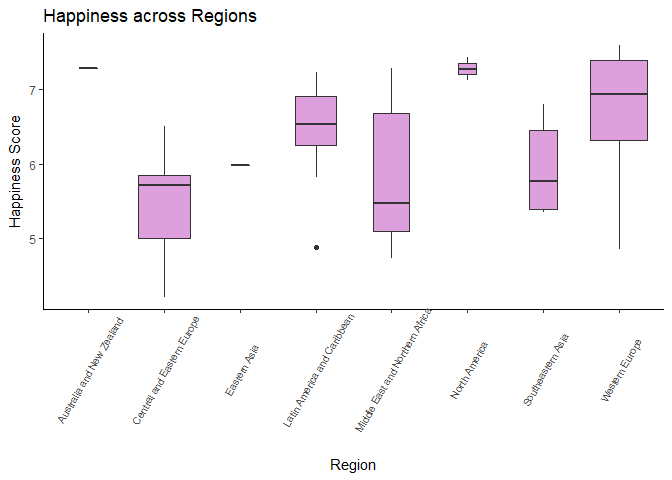
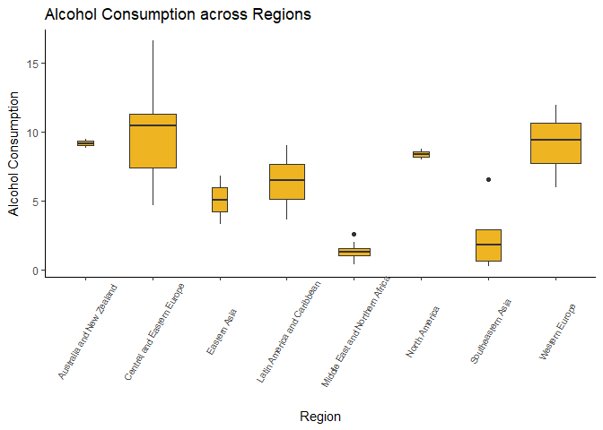

## Setup

### Load Librarys

-- Load Library for reading CSV Files.
-- Load tidyr-library
-- Load dplyr-library


```r
library(csvread)
library(tidyr)
library(dplyr)
```

```
## 
## Attaching package: 'dplyr'
```

```
## The following objects are masked from 'package:stats':
## 
##     filter, lag
```

```
## The following objects are masked from 'package:base':
## 
##     intersect, setdiff, setequal, union
```

```r
library(ggplot2)
library(ggthemes)
```

### Read Data

```r
master.data <- read.csv("../data/master_data/master_data.csv")
master.data
```

<div data-pagedtable="false">
  <script data-pagedtable-source type="application/json">
{"columns":[{"label":["Country"],"name":[1],"type":["fctr"],"align":["left"]},{"label":["Region"],"name":[2],"type":["fctr"],"align":["left"]},{"label":["Happiness.Score"],"name":[3],"type":["dbl"],"align":["right"]},{"label":["Happiness.Score.Standard.Error"],"name":[4],"type":["dbl"],"align":["right"]},{"label":["Economy.GDP.per.Capita"],"name":[5],"type":["dbl"],"align":["right"]},{"label":["Family"],"name":[6],"type":["dbl"],"align":["right"]},{"label":["Health.Life.Expectancy"],"name":[7],"type":["dbl"],"align":["right"]},{"label":["Freedom"],"name":[8],"type":["dbl"],"align":["right"]},{"label":["Trust.Government.Corruption"],"name":[9],"type":["dbl"],"align":["right"]},{"label":["Generosity"],"name":[10],"type":["dbl"],"align":["right"]},{"label":["Dystopia.Residual"],"name":[11],"type":["dbl"],"align":["right"]},{"label":["PISA.Performance.Mean.Mathematics"],"name":[12],"type":["dbl"],"align":["right"]},{"label":["PISA.Performance.Mean.Reading"],"name":[13],"type":["dbl"],"align":["right"]},{"label":["PISA.Performance.Mean.Science"],"name":[14],"type":["dbl"],"align":["right"]},{"label":["PISA.Performance.Mean"],"name":[15],"type":["dbl"],"align":["right"]},{"label":["Alcohol.Consumption.All.Types"],"name":[16],"type":["dbl"],"align":["right"]},{"label":["Beer"],"name":[17],"type":["dbl"],"align":["right"]},{"label":["Wine"],"name":[18],"type":["dbl"],"align":["right"]},{"label":["Spirits"],"name":[19],"type":["dbl"],"align":["right"]},{"label":["Other"],"name":[20],"type":["dbl"],"align":["right"]}],"data":[{"1":"Albania","2":"Central and Eastern Europe","3":"4.959","4":"0.05013","5":"0.87867","6":"0.80434","7":"0.81325","8":"0.35733","9":"0.06413","10":"0.14272","11":"1.89894","12":"413.1570","13":"405.2588","14":"427.2250","15":"415.2136","16":"4.77","17":"1.57","18":"1.17","19":"1.94","20":"0.08"},{"1":"Algeria","2":"Middle East and Northern Africa","3":"5.605","4":"0.05099","5":"0.93929","6":"1.07772","7":"0.61766","8":"0.28579","9":"0.17383","10":"0.07822","11":"2.43209","12":"359.6062","13":"349.8593","14":"375.7451","15":"361.7369","16":"0.56","17":"0.31","18":"0.14","19":"0.10","20":"0.00"},{"1":"Argentina","2":"Latin America and Caribbean","3":"6.574","4":"0.04612","5":"1.05351","6":"1.24823","7":"0.78723","8":"0.44974","9":"0.08484","10":"0.11451","11":"2.83600","12":"409.0333","13":"425.3031","14":"432.2262","15":"422.1875","16":"8.42","17":"3.36","18":"3.38","19":"0.81","20":"0.87"},{"1":"Australia","2":"Australia and New Zealand","3":"7.284","4":"0.04083","5":"1.33358","6":"1.30923","7":"0.93156","8":"0.65124","9":"0.35637","10":"0.43562","11":"2.26646","12":"493.8962","13":"502.9006","14":"509.9939","15":"502.2636","16":"9.52","17":"3.76","18":"3.66","19":"1.22","20":"0.88"},{"1":"Austria","2":"Western Europe","3":"7.200","4":"0.03751","5":"1.33723","6":"1.29704","7":"0.89042","8":"0.62433","9":"0.18676","10":"0.33088","11":"2.53320","12":"496.7423","13":"484.8656","14":"495.0375","15":"492.2151","16":"11.40","17":"6.10","18":"3.60","19":"1.70","20":"NA"},{"1":"Belgium","2":"Western Europe","3":"6.937","4":"0.03595","5":"1.30782","6":"1.28566","7":"0.89667","8":"0.58450","9":"0.22540","10":"0.22250","11":"2.41484","12":"506.9844","13":"498.5242","14":"501.9997","15":"502.5028","16":"10.36","17":"4.60","18":"3.97","19":"1.47","20":"0.32"},{"1":"Brazil","2":"Latin America and Caribbean","3":"6.983","4":"0.04076","5":"0.98124","6":"1.23287","7":"0.69702","8":"0.49049","9":"0.17521","10":"0.14574","11":"3.26001","12":"377.0695","13":"407.3486","14":"400.6821","15":"395.0334","16":"6.97","17":"4.45","18":"0.25","19":"2.24","20":"0.03"},{"1":"Bulgaria","2":"Central and Eastern Europe","3":"4.218","4":"0.04828","5":"1.01216","6":"1.10614","7":"0.76649","8":"0.30587","9":"0.00872","10":"0.11921","11":"0.89991","12":"441.1899","13":"431.7175","14":"445.7720","15":"439.5598","16":"11.30","17":"4.22","18":"1.96","19":"4.99","20":"0.13"},{"1":"Canada","2":"North America","3":"7.427","4":"0.03553","5":"1.32629","6":"1.32261","7":"0.90563","8":"0.63297","9":"0.32957","10":"0.45811","11":"2.45176","12":"515.6474","13":"526.6678","14":"527.7047","15":"523.3400","16":"8.00","17":"3.70","18":"2.00","19":"2.00","20":"0.30"},{"1":"Chile","2":"Latin America and Caribbean","3":"6.670","4":"0.05800","5":"1.10715","6":"1.12447","7":"0.85857","8":"0.44132","9":"0.12869","10":"0.33363","11":"2.67585","12":"422.6714","13":"458.5709","14":"446.9561","15":"442.7328","16":"7.89","17":"2.85","18":"2.61","19":"2.43","20":"0.00"},{"1":"Colombia","2":"Latin America and Caribbean","3":"6.477","4":"0.05051","5":"0.91861","6":"1.24018","7":"0.69077","8":"0.53466","9":"0.05120","10":"0.18401","11":"2.85737","12":"389.6438","13":"424.9052","14":"415.7288","15":"410.0926","16":"4.43","17":"3.13","18":"0.05","19":"1.23","20":"0.02"},{"1":"Costa Rica","2":"Latin America and Caribbean","3":"7.226","4":"0.04454","5":"0.95578","6":"1.23788","7":"0.86027","8":"0.63376","9":"0.10583","10":"0.25497","11":"3.17728","12":"400.2534","13":"427.4875","14":"419.6080","15":"415.7830","16":"3.63","17":"2.31","18":"0.27","19":"1.02","20":"0.03"},{"1":"Croatia","2":"Central and Eastern Europe","3":"5.759","4":"0.04394","5":"1.08254","6":"0.79624","7":"0.78805","8":"0.25883","9":"0.02430","10":"0.05444","11":"2.75414","12":"464.0401","13":"486.8632","14":"475.3912","15":"475.4315","16":"9.89","17":"4.50","18":"3.68","19":"1.34","20":"0.36"},{"1":"Cyprus","2":"Western Europe","3":"5.689","4":"0.05580","5":"1.20813","6":"0.89318","7":"0.92356","8":"0.40672","9":"0.06146","10":"0.30638","11":"1.88931","12":"437.1443","13":"442.8443","14":"432.5964","15":"437.5283","16":"9.55","17":"2.84","18":"2.71","19":"4.00","20":"0.00"},{"1":"Czech Republic","2":"Central and Eastern Europe","3":"6.505","4":"0.04168","5":"1.17898","6":"1.20643","7":"0.84483","8":"0.46364","9":"0.02652","10":"0.10686","11":"2.67782","12":"492.3254","13":"487.2501","14":"492.8300","15":"490.8018","16":"12.82","17":"6.90","18":"2.67","19":"3.25","20":"0.00"},{"1":"Denmark","2":"Western Europe","3":"7.527","4":"0.03328","5":"1.32548","6":"1.36058","7":"0.87464","8":"0.64938","9":"0.48357","10":"0.34139","11":"2.49204","12":"511.0876","13":"499.8146","14":"501.9369","15":"504.2797","16":"9.38","17":"3.49","18":"4.21","19":"1.68","20":"0.00"},{"1":"Dominican Republic","2":"Latin America and Caribbean","3":"4.885","4":"0.07446","5":"0.89537","6":"1.17202","7":"0.66825","8":"0.57672","9":"0.14234","10":"0.21684","11":"1.21305","12":"327.7020","13":"357.7377","14":"331.6388","15":"339.0262","16":"6.14","17":"3.49","18":"0.24","19":"2.34","20":"0.07"},{"1":"Estonia","2":"Central and Eastern Europe","3":"5.429","4":"0.04013","5":"1.15174","6":"1.22791","7":"0.77361","8":"0.44888","9":"0.15184","10":"0.08680","11":"1.58782","12":"519.5291","13":"519.1429","14":"534.1937","15":"524.2886","16":"16.64","17":"5.44","18":"1.23","19":"8.37","20":"1.60"},{"1":"Finland","2":"Western Europe","3":"7.406","4":"0.03140","5":"1.29025","6":"1.31826","7":"0.88911","8":"0.64169","9":"0.41372","10":"0.23351","11":"2.61955","12":"511.0769","13":"526.4247","14":"530.6612","15":"522.7209","16":"8.51","17":"4.13","18":"1.75","19":"1.84","20":"0.79"},{"1":"France","2":"Western Europe","3":"6.575","4":"0.03512","5":"1.27778","6":"1.26038","7":"0.94579","8":"0.55011","9":"0.20646","10":"0.12332","11":"2.21126","12":"492.9204","13":"499.3061","14":"494.9776","15":"495.7347","16":"11.87","17":"2.16","18":"7.09","19":"2.42","20":"0.20"},{"1":"Georgia","2":"Central and Eastern Europe","3":"4.297","4":"0.04221","5":"0.74190","6":"0.38562","7":"0.72926","8":"0.40577","9":"0.38331","10":"0.05547","11":"1.59541","12":"403.8332","13":"401.2881","14":"411.1315","15":"405.4176","16":"7.44","17":"1.37","18":"3.10","19":"2.97","20":"0.01"},{"1":"Germany","2":"Western Europe","3":"6.750","4":"0.01848","5":"1.32792","6":"1.29937","7":"0.89186","8":"0.61477","9":"0.21843","10":"0.28214","11":"2.11569","12":"505.9713","13":"509.1041","14":"509.1406","15":"508.0720","16":"11.99","17":"5.66","18":"3.84","19":"2.49","20":"0.00"},{"1":"Greece","2":"Western Europe","3":"4.857","4":"0.05062","5":"1.15406","6":"0.92933","7":"0.88213","8":"0.07699","9":"0.01397","10":"0.00000","11":"1.80101","12":"453.6299","13":"467.0395","14":"454.8288","15":"458.4994","16":"6.64","17":"2.04","18":"3.08","19":"1.44","20":"0.08"},{"1":"Hungary","2":"Central and Eastern Europe","3":"4.800","4":"0.06107","5":"1.12094","6":"1.20215","7":"0.75905","8":"0.32112","9":"0.02758","10":"0.12800","11":"1.24074","12":"476.8309","13":"469.5233","14":"476.7475","15":"474.3672","16":"10.90","17":"3.93","18":"3.41","19":"3.57","20":"NA"},{"1":"Iceland","2":"Western Europe","3":"7.561","4":"0.04884","5":"1.30232","6":"1.40223","7":"0.94784","8":"0.62877","9":"0.14145","10":"0.43630","11":"2.70201","12":"488.0332","13":"481.5255","14":"473.2301","15":"480.9296","16":"7.66","17":"4.26","18":"2.15","19":"1.25","20":"NA"},{"1":"Indonesia","2":"Southeastern Asia","3":"5.399","4":"0.02596","5":"0.82827","6":"1.08708","7":"0.63793","8":"0.46611","9":"0.00000","10":"0.51535","11":"1.86399","12":"386.1096","13":"397.2595","14":"403.0997","15":"395.4896","16":"0.28","17":"0.05","18":"0.22","19":"0.01","20":"0.00"},{"1":"Ireland","2":"Western Europe","3":"6.940","4":"0.03676","5":"1.33596","6":"1.36948","7":"0.89533","8":"0.61777","9":"0.28703","10":"0.45901","11":"1.97570","12":"503.7220","13":"520.8148","14":"502.5751","15":"509.0373","16":"10.93","17":"5.14","18":"3.06","19":"1.97","20":"0.77"},{"1":"Israel","2":"Middle East and Northern Africa","3":"7.278","4":"0.03470","5":"1.22857","6":"1.22393","7":"0.91387","8":"0.41319","9":"0.07785","10":"0.33172","11":"3.08854","12":"469.6695","13":"478.9606","14":"466.5528","15":"471.7276","16":"2.61","17":"1.41","18":"0.11","19":"1.05","20":"0.04"},{"1":"Italy","2":"Western Europe","3":"5.948","4":"0.03914","5":"1.25114","6":"1.19777","7":"0.95446","8":"0.26236","9":"0.02901","10":"0.22823","11":"2.02518","12":"489.7287","13":"484.7580","14":"480.5468","15":"485.0112","16":"7.14","17":"1.78","18":"4.61","19":"0.74","20":"0.00"},{"1":"Japan","2":"Eastern Asia","3":"5.987","4":"0.03581","5":"1.27074","6":"1.25712","7":"0.99111","8":"0.49615","9":"0.18060","10":"0.10705","11":"1.68435","12":"532.4399","13":"515.9585","14":"538.3948","15":"528.9311","16":"6.86","17":"1.25","18":"0.38","19":"2.74","20":"2.49"},{"1":"Jordan","2":"Middle East and Northern Africa","3":"5.192","4":"0.04524","5":"0.90198","6":"1.05392","7":"0.69639","8":"0.40661","9":"0.14293","10":"0.11053","11":"1.87996","12":"380.2590","13":"408.1022","14":"408.6691","15":"399.0101","16":"0.37","17":"0.07","18":"0.01","19":"0.29","20":"0.01"},{"1":"Kazakhstan","2":"Central and Eastern Europe","3":"5.855","4":"0.04114","5":"1.12254","6":"1.12241","7":"0.64368","8":"0.51649","9":"0.08454","10":"0.11827","11":"2.24729","12":"459.8160","13":"427.1410","14":"456.4836","15":"447.8135","16":"5.92","17":"1.78","18":"0.38","19":"3.76","20":"0.00"},{"1":"Latvia","2":"Central and Eastern Europe","3":"5.098","4":"0.04640","5":"1.11312","6":"1.09562","7":"0.72437","8":"0.29671","9":"0.06332","10":"0.18226","11":"1.62215","12":"482.3051","13":"487.7581","14":"490.2250","15":"486.7627","16":"10.82","17":"4.80","18":"1.24","19":"4.13","20":"0.65"},{"1":"Lebanon","2":"Middle East and Northern Africa","3":"4.839","4":"0.04337","5":"1.02564","6":"0.80001","7":"0.83947","8":"0.33916","9":"0.04582","10":"0.21854","11":"1.57059","12":"396.2497","13":"346.5490","14":"386.4854","15":"376.4280","16":"1.18","17":"0.38","18":"0.19","19":"0.59","20":"0.02"},{"1":"Lithuania","2":"Central and Eastern Europe","3":"5.833","4":"0.03843","5":"1.14723","6":"1.25745","7":"0.73128","8":"0.21342","9":"0.01031","10":"0.02641","11":"2.44649","12":"478.3834","13":"472.4066","14":"475.4089","15":"475.3996","16":"14.42","17":"6.28","18":"1.03","19":"5.35","20":"1.76"},{"1":"Luxembourg","2":"Western Europe","3":"6.946","4":"0.03499","5":"1.56391","6":"1.21963","7":"0.91894","8":"0.61583","9":"0.37798","10":"0.28034","11":"1.96961","12":"485.7706","13":"481.4391","14":"482.8064","15":"483.3387","16":"11.83","17":"3.91","18":"5.47","19":"2.46","20":"0.00"},{"1":"Macedonia","2":"Central and Eastern Europe","3":"5.007","4":"0.05376","5":"0.91851","6":"1.00232","7":"0.73545","8":"0.33457","9":"0.05327","10":"0.22359","11":"1.73933","12":"371.3114","13":"351.7415","14":"383.6824","15":"368.9118","16":"4.68","17":"1.67","18":"2.15","19":"0.84","20":"0.03"},{"1":"Malaysia","2":"Southeastern Asia","3":"5.770","4":"0.04330","5":"1.12486","6":"1.07023","7":"0.72394","8":"0.53024","9":"0.10501","10":"0.33075","11":"1.88541","12":"446.1098","13":"430.5782","14":"442.9475","15":"439.8785","16":"0.64","17":"0.39","18":"0.13","19":"0.11","20":"0.01"},{"1":"Malta","2":"Western Europe","3":"6.302","4":"0.04206","5":"1.20740","6":"1.30203","7":"0.88721","8":"0.60365","9":"0.13586","10":"0.51752","11":"1.64880","12":"478.6448","13":"446.6661","14":"464.7819","15":"463.3643","16":"7.75","17":"2.96","18":"2.21","19":"2.16","20":"0.42"},{"1":"Mexico","2":"Latin America and Caribbean","3":"7.187","4":"0.04176","5":"1.02054","6":"0.91451","7":"0.81444","8":"0.48181","9":"0.21312","10":"0.14074","11":"3.60214","12":"408.0235","13":"423.2765","14":"415.7099","15":"415.6700","16":"5.28","17":"4.01","18":"0.11","19":"1.14","20":"0.03"},{"1":"Moldova","2":"Central and Eastern Europe","3":"5.889","4":"0.03799","5":"0.59448","6":"1.01528","7":"0.61826","8":"0.32818","9":"0.01615","10":"0.20951","11":"3.10712","12":"419.6635","13":"416.2293","14":"427.9978","15":"421.2969","16":"9.39","17":"1.52","18":"5.25","19":"2.43","20":"0.19"},{"1":"Montenegro","2":"Central and Eastern Europe","3":"5.192","4":"0.05235","5":"0.97438","6":"0.90557","7":"0.72521","8":"0.18260","9":"0.14296","10":"0.16140","11":"2.10017","12":"417.9341","13":"426.8845","14":"411.3136","15":"418.7107","16":"6.41","17":"0.69","18":"2.76","19":"2.83","20":"0.13"},{"1":"Netherlands","2":"Western Europe","3":"7.378","4":"0.02799","5":"1.32944","6":"1.28017","7":"0.89284","8":"0.61576","9":"0.31814","10":"0.47610","11":"2.46570","12":"512.2528","13":"502.9591","14":"508.5748","15":"507.9289","16":"8.03","17":"3.83","18":"2.88","19":"1.32","20":"0.00"},{"1":"New Zealand","2":"Australia and New Zealand","3":"7.286","4":"0.03371","5":"1.25018","6":"1.31967","7":"0.90837","8":"0.63938","9":"0.42922","10":"0.47501","11":"2.26425","12":"495.2233","13":"509.2707","14":"513.3035","15":"505.9325","16":"8.87","17":"3.35","18":"2.97","19":"2.53","20":"0.03"},{"1":"Norway","2":"Western Europe","3":"7.522","4":"0.03880","5":"1.45900","6":"1.33095","7":"0.88521","8":"0.66973","9":"0.36503","10":"0.34699","11":"2.46531","12":"501.7298","13":"513.1912","14":"498.4811","15":"504.4674","16":"5.97","17":"2.57","18":"2.22","19":"1.03","20":"0.15"},{"1":"Peru","2":"Latin America and Caribbean","3":"5.824","4":"0.04615","5":"0.90019","6":"0.97459","7":"0.73017","8":"0.41496","9":"0.05989","10":"0.14982","11":"2.59450","12":"386.5606","13":"397.5414","14":"396.6836","15":"393.5952","16":"5.10","17":"3.06","18":"0.41","19":"1.62","20":"0.00"},{"1":"Poland","2":"Central and Eastern Europe","3":"5.791","4":"0.04263","5":"1.12555","6":"1.27948","7":"0.77903","8":"0.53122","9":"0.04212","10":"0.16759","11":"1.86565","12":"504.4693","13":"505.6971","14":"501.4353","15":"503.8672","16":"10.48","17":"5.83","18":"0.89","19":"3.76","20":"0.00"},{"1":"Portugal","2":"Western Europe","3":"5.102","4":"0.04802","5":"1.15991","6":"1.13935","7":"0.87519","8":"0.51469","9":"0.01078","10":"0.13719","11":"1.26462","12":"491.6270","13":"498.1289","14":"501.1001","15":"496.9520","16":"10.54","17":"2.69","18":"6.54","19":"0.82","20":"0.48"},{"1":"Qatar","2":"Middle East and Northern Africa","3":"6.611","4":"0.06257","5":"1.69042","6":"1.07860","7":"0.79733","8":"0.64040","9":"0.52208","10":"0.32573","11":"1.55674","12":"402.4007","13":"401.8874","14":"417.6112","15":"407.2998","16":"1.26","17":"0.33","18":"0.13","19":"0.79","20":"0.01"},{"1":"Russian Federation","2":"Central and Eastern Europe","3":"5.716","4":"0.03135","5":"1.13764","6":"1.23617","7":"0.66926","8":"0.36679","9":"0.03005","10":"0.00199","11":"2.27394","12":"494.0600","13":"494.6278","14":"486.6310","15":"491.7729","16":"8.41","17":"3.49","18":"0.87","19":"3.36","20":"0.69"},{"1":"Singapore","2":"Southeastern Asia","3":"6.798","4":"0.03780","5":"1.52186","6":"1.02000","7":"1.02525","8":"0.54252","9":"0.49210","10":"0.31105","11":"1.88501","12":"564.1897","13":"535.1002","14":"555.5747","15":"551.6215","16":"1.80","17":"1.25","18":"0.27","19":"0.25","20":"0.03"},{"1":"Slovakia","2":"Central and Eastern Europe","3":"5.995","4":"0.04267","5":"1.16891","6":"1.26999","7":"0.78902","8":"0.31751","9":"0.03431","10":"0.16893","11":"2.24639","12":"475.2301","13":"452.5143","14":"460.7749","15":"462.8398","16":"10.78","17":"3.44","18":"2.61","19":"4.27","20":"0.47"},{"1":"Slovenia","2":"Central and Eastern Europe","3":"5.848","4":"0.04251","5":"1.18498","6":"1.27385","7":"0.87337","8":"0.60855","9":"0.03787","10":"0.25328","11":"1.61583","12":"509.9196","13":"505.2159","14":"512.8636","15":"509.3330","16":"11.49","17":"5.73","18":"4.90","19":"0.86","20":"0.00"},{"1":"South Korea","2":"Eastern Asia","3":"5.984","4":"0.04098","5":"1.24461","6":"0.95774","7":"0.96538","8":"0.33208","9":"0.07857","10":"0.18557","11":"2.21978","12":"524.1062","13":"517.4367","14":"515.8099","15":"519.1176","16":"3.35","17":"0.09","18":"0.00","19":"3.26","20":"0.00"},{"1":"Spain","2":"Western Europe","3":"6.329","4":"0.03468","5":"1.23011","6":"1.31379","7":"0.95562","8":"0.45951","9":"0.06398","10":"0.18227","11":"2.12367","12":"485.8432","13":"495.5764","14":"492.7861","15":"491.4019","16":"8.26","17":"4.51","18":"1.55","19":"2.21","20":"0.00"},{"1":"Sweden","2":"Western Europe","3":"7.364","4":"0.03157","5":"1.33171","6":"1.28907","7":"0.91087","8":"0.65980","9":"0.43844","10":"0.36262","11":"2.37119","12":"493.9181","13":"500.1556","14":"493.4224","15":"495.8320","16":"7.16","17":"2.62","18":"3.42","19":"1.01","20":"0.11"},{"1":"Switzerland","2":"Western Europe","3":"7.587","4":"0.03411","5":"1.39651","6":"1.34951","7":"0.94143","8":"0.66557","9":"0.41978","10":"0.29678","11":"2.51738","12":"521.2506","13":"492.1982","14":"505.5058","15":"506.3182","16":"9.62","17":"3.17","18":"4.58","19":"1.76","20":"0.12"},{"1":"Thailand","2":"Southeastern Asia","3":"6.455","4":"0.03557","5":"0.96690","6":"1.26504","7":"0.73850","8":"0.55664","9":"0.03187","10":"0.57630","11":"2.31945","12":"415.4638","13":"409.1301","14":"421.3373","15":"415.3104","16":"6.57","17":"1.86","18":"0.18","19":"4.53","20":"0.00"},{"1":"Trinidad and Tobago","2":"Latin America and Caribbean","3":"6.168","4":"0.10895","5":"1.21183","6":"1.18354","7":"0.61483","8":"0.55884","9":"0.01140","10":"0.31844","11":"2.26882","12":"417.2434","13":"427.2733","14":"424.5905","15":"423.0357","16":"6.87","17":"3.73","18":"0.25","19":"2.77","20":"0.13"},{"1":"Tunisia","2":"Middle East and Northern Africa","3":"4.739","4":"0.03589","5":"0.88113","6":"0.60429","7":"0.73793","8":"0.26268","9":"0.06358","10":"0.06431","11":"2.12466","12":"366.8180","13":"361.0555","14":"386.4034","15":"371.4256","16":"1.42","17":"1.04","18":"0.33","19":"0.05","20":"0.00"},{"1":"Turkey","2":"Middle East and Northern Africa","3":"5.332","4":"0.03864","5":"1.06098","6":"0.94632","7":"0.73172","8":"0.22815","9":"0.15746","10":"0.12253","11":"2.08528","12":"420.4540","13":"428.3351","14":"425.4895","15":"424.7595","16":"1.40","17":"0.80","18":"0.13","19":"0.47","20":"0.00"},{"1":"United Arab Emirates","2":"Middle East and Northern Africa","3":"6.901","4":"0.03729","5":"1.42727","6":"1.12575","7":"0.80925","8":"0.64157","9":"0.38583","10":"0.26428","11":"2.24743","12":"427.4827","13":"433.5423","14":"436.7311","15":"432.5854","16":"2.03","17":"0.21","18":"0.14","19":"1.68","20":"0.01"},{"1":"United Kingdom","2":"Western Europe","3":"6.867","4":"0.01866","5":"1.26637","6":"1.28548","7":"0.90943","8":"0.59625","9":"0.32067","10":"0.51912","11":"1.96994","12":"492.4785","13":"497.9719","14":"509.2215","15":"499.8906","16":"9.82","17":"3.49","18":"3.48","19":"2.13","20":"0.73"},{"1":"United States","2":"North America","3":"7.119","4":"0.03839","5":"1.39451","6":"1.24711","7":"0.86179","8":"0.54604","9":"0.15890","10":"0.40105","11":"2.51011","12":"469.6285","13":"496.9351","14":"496.2424","15":"487.6020","16":"8.78","17":"4.13","18":"1.59","19":"3.07","20":"NA"},{"1":"Uruguay","2":"Latin America and Caribbean","3":"6.485","4":"0.04539","5":"1.06166","6":"1.20890","7":"0.81160","8":"0.60362","9":"0.24558","10":"0.23240","11":"2.32142","12":"417.9919","13":"436.5721","14":"435.3630","15":"429.9757","16":"9.03","17":"3.18","18":"3.94","19":"1.91","20":"0.00"},{"1":"Vietnam","2":"Southeastern Asia","3":"5.360","4":"0.03107","5":"0.63216","6":"0.91226","7":"0.74676","8":"0.59444","9":"0.10441","10":"0.16860","11":"2.20173","12":"494.5183","13":"486.7738","14":"524.6445","15":"501.9789","16":"2.92","17":"2.67","18":"0.02","19":"0.23","20":"0.00"}],"options":{"columns":{"min":{},"max":[10]},"rows":{"min":[10],"max":[10]},"pages":{}}}
  </script>
</div>

## Select relevant columns for regional analysis

Too many countries for plot analysis, therefore we take the respective regions as categories


```r
region.data <- select(master.data, -Country, Happiness.Score.Standard.Error)
region.data 
```

<div data-pagedtable="false">
  <script data-pagedtable-source type="application/json">
{"columns":[{"label":["Region"],"name":[1],"type":["fctr"],"align":["left"]},{"label":["Happiness.Score"],"name":[2],"type":["dbl"],"align":["right"]},{"label":["Happiness.Score.Standard.Error"],"name":[3],"type":["dbl"],"align":["right"]},{"label":["Economy.GDP.per.Capita"],"name":[4],"type":["dbl"],"align":["right"]},{"label":["Family"],"name":[5],"type":["dbl"],"align":["right"]},{"label":["Health.Life.Expectancy"],"name":[6],"type":["dbl"],"align":["right"]},{"label":["Freedom"],"name":[7],"type":["dbl"],"align":["right"]},{"label":["Trust.Government.Corruption"],"name":[8],"type":["dbl"],"align":["right"]},{"label":["Generosity"],"name":[9],"type":["dbl"],"align":["right"]},{"label":["Dystopia.Residual"],"name":[10],"type":["dbl"],"align":["right"]},{"label":["PISA.Performance.Mean.Mathematics"],"name":[11],"type":["dbl"],"align":["right"]},{"label":["PISA.Performance.Mean.Reading"],"name":[12],"type":["dbl"],"align":["right"]},{"label":["PISA.Performance.Mean.Science"],"name":[13],"type":["dbl"],"align":["right"]},{"label":["PISA.Performance.Mean"],"name":[14],"type":["dbl"],"align":["right"]},{"label":["Alcohol.Consumption.All.Types"],"name":[15],"type":["dbl"],"align":["right"]},{"label":["Beer"],"name":[16],"type":["dbl"],"align":["right"]},{"label":["Wine"],"name":[17],"type":["dbl"],"align":["right"]},{"label":["Spirits"],"name":[18],"type":["dbl"],"align":["right"]},{"label":["Other"],"name":[19],"type":["dbl"],"align":["right"]}],"data":[{"1":"Central and Eastern Europe","2":"4.959","3":"0.05013","4":"0.87867","5":"0.80434","6":"0.81325","7":"0.35733","8":"0.06413","9":"0.14272","10":"1.89894","11":"413.1570","12":"405.2588","13":"427.2250","14":"415.2136","15":"4.77","16":"1.57","17":"1.17","18":"1.94","19":"0.08"},{"1":"Middle East and Northern Africa","2":"5.605","3":"0.05099","4":"0.93929","5":"1.07772","6":"0.61766","7":"0.28579","8":"0.17383","9":"0.07822","10":"2.43209","11":"359.6062","12":"349.8593","13":"375.7451","14":"361.7369","15":"0.56","16":"0.31","17":"0.14","18":"0.10","19":"0.00"},{"1":"Latin America and Caribbean","2":"6.574","3":"0.04612","4":"1.05351","5":"1.24823","6":"0.78723","7":"0.44974","8":"0.08484","9":"0.11451","10":"2.83600","11":"409.0333","12":"425.3031","13":"432.2262","14":"422.1875","15":"8.42","16":"3.36","17":"3.38","18":"0.81","19":"0.87"},{"1":"Australia and New Zealand","2":"7.284","3":"0.04083","4":"1.33358","5":"1.30923","6":"0.93156","7":"0.65124","8":"0.35637","9":"0.43562","10":"2.26646","11":"493.8962","12":"502.9006","13":"509.9939","14":"502.2636","15":"9.52","16":"3.76","17":"3.66","18":"1.22","19":"0.88"},{"1":"Western Europe","2":"7.200","3":"0.03751","4":"1.33723","5":"1.29704","6":"0.89042","7":"0.62433","8":"0.18676","9":"0.33088","10":"2.53320","11":"496.7423","12":"484.8656","13":"495.0375","14":"492.2151","15":"11.40","16":"6.10","17":"3.60","18":"1.70","19":"NA"},{"1":"Western Europe","2":"6.937","3":"0.03595","4":"1.30782","5":"1.28566","6":"0.89667","7":"0.58450","8":"0.22540","9":"0.22250","10":"2.41484","11":"506.9844","12":"498.5242","13":"501.9997","14":"502.5028","15":"10.36","16":"4.60","17":"3.97","18":"1.47","19":"0.32"},{"1":"Latin America and Caribbean","2":"6.983","3":"0.04076","4":"0.98124","5":"1.23287","6":"0.69702","7":"0.49049","8":"0.17521","9":"0.14574","10":"3.26001","11":"377.0695","12":"407.3486","13":"400.6821","14":"395.0334","15":"6.97","16":"4.45","17":"0.25","18":"2.24","19":"0.03"},{"1":"Central and Eastern Europe","2":"4.218","3":"0.04828","4":"1.01216","5":"1.10614","6":"0.76649","7":"0.30587","8":"0.00872","9":"0.11921","10":"0.89991","11":"441.1899","12":"431.7175","13":"445.7720","14":"439.5598","15":"11.30","16":"4.22","17":"1.96","18":"4.99","19":"0.13"},{"1":"North America","2":"7.427","3":"0.03553","4":"1.32629","5":"1.32261","6":"0.90563","7":"0.63297","8":"0.32957","9":"0.45811","10":"2.45176","11":"515.6474","12":"526.6678","13":"527.7047","14":"523.3400","15":"8.00","16":"3.70","17":"2.00","18":"2.00","19":"0.30"},{"1":"Latin America and Caribbean","2":"6.670","3":"0.05800","4":"1.10715","5":"1.12447","6":"0.85857","7":"0.44132","8":"0.12869","9":"0.33363","10":"2.67585","11":"422.6714","12":"458.5709","13":"446.9561","14":"442.7328","15":"7.89","16":"2.85","17":"2.61","18":"2.43","19":"0.00"},{"1":"Latin America and Caribbean","2":"6.477","3":"0.05051","4":"0.91861","5":"1.24018","6":"0.69077","7":"0.53466","8":"0.05120","9":"0.18401","10":"2.85737","11":"389.6438","12":"424.9052","13":"415.7288","14":"410.0926","15":"4.43","16":"3.13","17":"0.05","18":"1.23","19":"0.02"},{"1":"Latin America and Caribbean","2":"7.226","3":"0.04454","4":"0.95578","5":"1.23788","6":"0.86027","7":"0.63376","8":"0.10583","9":"0.25497","10":"3.17728","11":"400.2534","12":"427.4875","13":"419.6080","14":"415.7830","15":"3.63","16":"2.31","17":"0.27","18":"1.02","19":"0.03"},{"1":"Central and Eastern Europe","2":"5.759","3":"0.04394","4":"1.08254","5":"0.79624","6":"0.78805","7":"0.25883","8":"0.02430","9":"0.05444","10":"2.75414","11":"464.0401","12":"486.8632","13":"475.3912","14":"475.4315","15":"9.89","16":"4.50","17":"3.68","18":"1.34","19":"0.36"},{"1":"Western Europe","2":"5.689","3":"0.05580","4":"1.20813","5":"0.89318","6":"0.92356","7":"0.40672","8":"0.06146","9":"0.30638","10":"1.88931","11":"437.1443","12":"442.8443","13":"432.5964","14":"437.5283","15":"9.55","16":"2.84","17":"2.71","18":"4.00","19":"0.00"},{"1":"Central and Eastern Europe","2":"6.505","3":"0.04168","4":"1.17898","5":"1.20643","6":"0.84483","7":"0.46364","8":"0.02652","9":"0.10686","10":"2.67782","11":"492.3254","12":"487.2501","13":"492.8300","14":"490.8018","15":"12.82","16":"6.90","17":"2.67","18":"3.25","19":"0.00"},{"1":"Western Europe","2":"7.527","3":"0.03328","4":"1.32548","5":"1.36058","6":"0.87464","7":"0.64938","8":"0.48357","9":"0.34139","10":"2.49204","11":"511.0876","12":"499.8146","13":"501.9369","14":"504.2797","15":"9.38","16":"3.49","17":"4.21","18":"1.68","19":"0.00"},{"1":"Latin America and Caribbean","2":"4.885","3":"0.07446","4":"0.89537","5":"1.17202","6":"0.66825","7":"0.57672","8":"0.14234","9":"0.21684","10":"1.21305","11":"327.7020","12":"357.7377","13":"331.6388","14":"339.0262","15":"6.14","16":"3.49","17":"0.24","18":"2.34","19":"0.07"},{"1":"Central and Eastern Europe","2":"5.429","3":"0.04013","4":"1.15174","5":"1.22791","6":"0.77361","7":"0.44888","8":"0.15184","9":"0.08680","10":"1.58782","11":"519.5291","12":"519.1429","13":"534.1937","14":"524.2886","15":"16.64","16":"5.44","17":"1.23","18":"8.37","19":"1.60"},{"1":"Western Europe","2":"7.406","3":"0.03140","4":"1.29025","5":"1.31826","6":"0.88911","7":"0.64169","8":"0.41372","9":"0.23351","10":"2.61955","11":"511.0769","12":"526.4247","13":"530.6612","14":"522.7209","15":"8.51","16":"4.13","17":"1.75","18":"1.84","19":"0.79"},{"1":"Western Europe","2":"6.575","3":"0.03512","4":"1.27778","5":"1.26038","6":"0.94579","7":"0.55011","8":"0.20646","9":"0.12332","10":"2.21126","11":"492.9204","12":"499.3061","13":"494.9776","14":"495.7347","15":"11.87","16":"2.16","17":"7.09","18":"2.42","19":"0.20"},{"1":"Central and Eastern Europe","2":"4.297","3":"0.04221","4":"0.74190","5":"0.38562","6":"0.72926","7":"0.40577","8":"0.38331","9":"0.05547","10":"1.59541","11":"403.8332","12":"401.2881","13":"411.1315","14":"405.4176","15":"7.44","16":"1.37","17":"3.10","18":"2.97","19":"0.01"},{"1":"Western Europe","2":"6.750","3":"0.01848","4":"1.32792","5":"1.29937","6":"0.89186","7":"0.61477","8":"0.21843","9":"0.28214","10":"2.11569","11":"505.9713","12":"509.1041","13":"509.1406","14":"508.0720","15":"11.99","16":"5.66","17":"3.84","18":"2.49","19":"0.00"},{"1":"Western Europe","2":"4.857","3":"0.05062","4":"1.15406","5":"0.92933","6":"0.88213","7":"0.07699","8":"0.01397","9":"0.00000","10":"1.80101","11":"453.6299","12":"467.0395","13":"454.8288","14":"458.4994","15":"6.64","16":"2.04","17":"3.08","18":"1.44","19":"0.08"},{"1":"Central and Eastern Europe","2":"4.800","3":"0.06107","4":"1.12094","5":"1.20215","6":"0.75905","7":"0.32112","8":"0.02758","9":"0.12800","10":"1.24074","11":"476.8309","12":"469.5233","13":"476.7475","14":"474.3672","15":"10.90","16":"3.93","17":"3.41","18":"3.57","19":"NA"},{"1":"Western Europe","2":"7.561","3":"0.04884","4":"1.30232","5":"1.40223","6":"0.94784","7":"0.62877","8":"0.14145","9":"0.43630","10":"2.70201","11":"488.0332","12":"481.5255","13":"473.2301","14":"480.9296","15":"7.66","16":"4.26","17":"2.15","18":"1.25","19":"NA"},{"1":"Southeastern Asia","2":"5.399","3":"0.02596","4":"0.82827","5":"1.08708","6":"0.63793","7":"0.46611","8":"0.00000","9":"0.51535","10":"1.86399","11":"386.1096","12":"397.2595","13":"403.0997","14":"395.4896","15":"0.28","16":"0.05","17":"0.22","18":"0.01","19":"0.00"},{"1":"Western Europe","2":"6.940","3":"0.03676","4":"1.33596","5":"1.36948","6":"0.89533","7":"0.61777","8":"0.28703","9":"0.45901","10":"1.97570","11":"503.7220","12":"520.8148","13":"502.5751","14":"509.0373","15":"10.93","16":"5.14","17":"3.06","18":"1.97","19":"0.77"},{"1":"Middle East and Northern Africa","2":"7.278","3":"0.03470","4":"1.22857","5":"1.22393","6":"0.91387","7":"0.41319","8":"0.07785","9":"0.33172","10":"3.08854","11":"469.6695","12":"478.9606","13":"466.5528","14":"471.7276","15":"2.61","16":"1.41","17":"0.11","18":"1.05","19":"0.04"},{"1":"Western Europe","2":"5.948","3":"0.03914","4":"1.25114","5":"1.19777","6":"0.95446","7":"0.26236","8":"0.02901","9":"0.22823","10":"2.02518","11":"489.7287","12":"484.7580","13":"480.5468","14":"485.0112","15":"7.14","16":"1.78","17":"4.61","18":"0.74","19":"0.00"},{"1":"Eastern Asia","2":"5.987","3":"0.03581","4":"1.27074","5":"1.25712","6":"0.99111","7":"0.49615","8":"0.18060","9":"0.10705","10":"1.68435","11":"532.4399","12":"515.9585","13":"538.3948","14":"528.9311","15":"6.86","16":"1.25","17":"0.38","18":"2.74","19":"2.49"},{"1":"Middle East and Northern Africa","2":"5.192","3":"0.04524","4":"0.90198","5":"1.05392","6":"0.69639","7":"0.40661","8":"0.14293","9":"0.11053","10":"1.87996","11":"380.2590","12":"408.1022","13":"408.6691","14":"399.0101","15":"0.37","16":"0.07","17":"0.01","18":"0.29","19":"0.01"},{"1":"Central and Eastern Europe","2":"5.855","3":"0.04114","4":"1.12254","5":"1.12241","6":"0.64368","7":"0.51649","8":"0.08454","9":"0.11827","10":"2.24729","11":"459.8160","12":"427.1410","13":"456.4836","14":"447.8135","15":"5.92","16":"1.78","17":"0.38","18":"3.76","19":"0.00"},{"1":"Central and Eastern Europe","2":"5.098","3":"0.04640","4":"1.11312","5":"1.09562","6":"0.72437","7":"0.29671","8":"0.06332","9":"0.18226","10":"1.62215","11":"482.3051","12":"487.7581","13":"490.2250","14":"486.7627","15":"10.82","16":"4.80","17":"1.24","18":"4.13","19":"0.65"},{"1":"Middle East and Northern Africa","2":"4.839","3":"0.04337","4":"1.02564","5":"0.80001","6":"0.83947","7":"0.33916","8":"0.04582","9":"0.21854","10":"1.57059","11":"396.2497","12":"346.5490","13":"386.4854","14":"376.4280","15":"1.18","16":"0.38","17":"0.19","18":"0.59","19":"0.02"},{"1":"Central and Eastern Europe","2":"5.833","3":"0.03843","4":"1.14723","5":"1.25745","6":"0.73128","7":"0.21342","8":"0.01031","9":"0.02641","10":"2.44649","11":"478.3834","12":"472.4066","13":"475.4089","14":"475.3996","15":"14.42","16":"6.28","17":"1.03","18":"5.35","19":"1.76"},{"1":"Western Europe","2":"6.946","3":"0.03499","4":"1.56391","5":"1.21963","6":"0.91894","7":"0.61583","8":"0.37798","9":"0.28034","10":"1.96961","11":"485.7706","12":"481.4391","13":"482.8064","14":"483.3387","15":"11.83","16":"3.91","17":"5.47","18":"2.46","19":"0.00"},{"1":"Central and Eastern Europe","2":"5.007","3":"0.05376","4":"0.91851","5":"1.00232","6":"0.73545","7":"0.33457","8":"0.05327","9":"0.22359","10":"1.73933","11":"371.3114","12":"351.7415","13":"383.6824","14":"368.9118","15":"4.68","16":"1.67","17":"2.15","18":"0.84","19":"0.03"},{"1":"Southeastern Asia","2":"5.770","3":"0.04330","4":"1.12486","5":"1.07023","6":"0.72394","7":"0.53024","8":"0.10501","9":"0.33075","10":"1.88541","11":"446.1098","12":"430.5782","13":"442.9475","14":"439.8785","15":"0.64","16":"0.39","17":"0.13","18":"0.11","19":"0.01"},{"1":"Western Europe","2":"6.302","3":"0.04206","4":"1.20740","5":"1.30203","6":"0.88721","7":"0.60365","8":"0.13586","9":"0.51752","10":"1.64880","11":"478.6448","12":"446.6661","13":"464.7819","14":"463.3643","15":"7.75","16":"2.96","17":"2.21","18":"2.16","19":"0.42"},{"1":"Latin America and Caribbean","2":"7.187","3":"0.04176","4":"1.02054","5":"0.91451","6":"0.81444","7":"0.48181","8":"0.21312","9":"0.14074","10":"3.60214","11":"408.0235","12":"423.2765","13":"415.7099","14":"415.6700","15":"5.28","16":"4.01","17":"0.11","18":"1.14","19":"0.03"},{"1":"Central and Eastern Europe","2":"5.889","3":"0.03799","4":"0.59448","5":"1.01528","6":"0.61826","7":"0.32818","8":"0.01615","9":"0.20951","10":"3.10712","11":"419.6635","12":"416.2293","13":"427.9978","14":"421.2969","15":"9.39","16":"1.52","17":"5.25","18":"2.43","19":"0.19"},{"1":"Central and Eastern Europe","2":"5.192","3":"0.05235","4":"0.97438","5":"0.90557","6":"0.72521","7":"0.18260","8":"0.14296","9":"0.16140","10":"2.10017","11":"417.9341","12":"426.8845","13":"411.3136","14":"418.7107","15":"6.41","16":"0.69","17":"2.76","18":"2.83","19":"0.13"},{"1":"Western Europe","2":"7.378","3":"0.02799","4":"1.32944","5":"1.28017","6":"0.89284","7":"0.61576","8":"0.31814","9":"0.47610","10":"2.46570","11":"512.2528","12":"502.9591","13":"508.5748","14":"507.9289","15":"8.03","16":"3.83","17":"2.88","18":"1.32","19":"0.00"},{"1":"Australia and New Zealand","2":"7.286","3":"0.03371","4":"1.25018","5":"1.31967","6":"0.90837","7":"0.63938","8":"0.42922","9":"0.47501","10":"2.26425","11":"495.2233","12":"509.2707","13":"513.3035","14":"505.9325","15":"8.87","16":"3.35","17":"2.97","18":"2.53","19":"0.03"},{"1":"Western Europe","2":"7.522","3":"0.03880","4":"1.45900","5":"1.33095","6":"0.88521","7":"0.66973","8":"0.36503","9":"0.34699","10":"2.46531","11":"501.7298","12":"513.1912","13":"498.4811","14":"504.4674","15":"5.97","16":"2.57","17":"2.22","18":"1.03","19":"0.15"},{"1":"Latin America and Caribbean","2":"5.824","3":"0.04615","4":"0.90019","5":"0.97459","6":"0.73017","7":"0.41496","8":"0.05989","9":"0.14982","10":"2.59450","11":"386.5606","12":"397.5414","13":"396.6836","14":"393.5952","15":"5.10","16":"3.06","17":"0.41","18":"1.62","19":"0.00"},{"1":"Central and Eastern Europe","2":"5.791","3":"0.04263","4":"1.12555","5":"1.27948","6":"0.77903","7":"0.53122","8":"0.04212","9":"0.16759","10":"1.86565","11":"504.4693","12":"505.6971","13":"501.4353","14":"503.8672","15":"10.48","16":"5.83","17":"0.89","18":"3.76","19":"0.00"},{"1":"Western Europe","2":"5.102","3":"0.04802","4":"1.15991","5":"1.13935","6":"0.87519","7":"0.51469","8":"0.01078","9":"0.13719","10":"1.26462","11":"491.6270","12":"498.1289","13":"501.1001","14":"496.9520","15":"10.54","16":"2.69","17":"6.54","18":"0.82","19":"0.48"},{"1":"Middle East and Northern Africa","2":"6.611","3":"0.06257","4":"1.69042","5":"1.07860","6":"0.79733","7":"0.64040","8":"0.52208","9":"0.32573","10":"1.55674","11":"402.4007","12":"401.8874","13":"417.6112","14":"407.2998","15":"1.26","16":"0.33","17":"0.13","18":"0.79","19":"0.01"},{"1":"Central and Eastern Europe","2":"5.716","3":"0.03135","4":"1.13764","5":"1.23617","6":"0.66926","7":"0.36679","8":"0.03005","9":"0.00199","10":"2.27394","11":"494.0600","12":"494.6278","13":"486.6310","14":"491.7729","15":"8.41","16":"3.49","17":"0.87","18":"3.36","19":"0.69"},{"1":"Southeastern Asia","2":"6.798","3":"0.03780","4":"1.52186","5":"1.02000","6":"1.02525","7":"0.54252","8":"0.49210","9":"0.31105","10":"1.88501","11":"564.1897","12":"535.1002","13":"555.5747","14":"551.6215","15":"1.80","16":"1.25","17":"0.27","18":"0.25","19":"0.03"},{"1":"Central and Eastern Europe","2":"5.995","3":"0.04267","4":"1.16891","5":"1.26999","6":"0.78902","7":"0.31751","8":"0.03431","9":"0.16893","10":"2.24639","11":"475.2301","12":"452.5143","13":"460.7749","14":"462.8398","15":"10.78","16":"3.44","17":"2.61","18":"4.27","19":"0.47"},{"1":"Central and Eastern Europe","2":"5.848","3":"0.04251","4":"1.18498","5":"1.27385","6":"0.87337","7":"0.60855","8":"0.03787","9":"0.25328","10":"1.61583","11":"509.9196","12":"505.2159","13":"512.8636","14":"509.3330","15":"11.49","16":"5.73","17":"4.90","18":"0.86","19":"0.00"},{"1":"Eastern Asia","2":"5.984","3":"0.04098","4":"1.24461","5":"0.95774","6":"0.96538","7":"0.33208","8":"0.07857","9":"0.18557","10":"2.21978","11":"524.1062","12":"517.4367","13":"515.8099","14":"519.1176","15":"3.35","16":"0.09","17":"0.00","18":"3.26","19":"0.00"},{"1":"Western Europe","2":"6.329","3":"0.03468","4":"1.23011","5":"1.31379","6":"0.95562","7":"0.45951","8":"0.06398","9":"0.18227","10":"2.12367","11":"485.8432","12":"495.5764","13":"492.7861","14":"491.4019","15":"8.26","16":"4.51","17":"1.55","18":"2.21","19":"0.00"},{"1":"Western Europe","2":"7.364","3":"0.03157","4":"1.33171","5":"1.28907","6":"0.91087","7":"0.65980","8":"0.43844","9":"0.36262","10":"2.37119","11":"493.9181","12":"500.1556","13":"493.4224","14":"495.8320","15":"7.16","16":"2.62","17":"3.42","18":"1.01","19":"0.11"},{"1":"Western Europe","2":"7.587","3":"0.03411","4":"1.39651","5":"1.34951","6":"0.94143","7":"0.66557","8":"0.41978","9":"0.29678","10":"2.51738","11":"521.2506","12":"492.1982","13":"505.5058","14":"506.3182","15":"9.62","16":"3.17","17":"4.58","18":"1.76","19":"0.12"},{"1":"Southeastern Asia","2":"6.455","3":"0.03557","4":"0.96690","5":"1.26504","6":"0.73850","7":"0.55664","8":"0.03187","9":"0.57630","10":"2.31945","11":"415.4638","12":"409.1301","13":"421.3373","14":"415.3104","15":"6.57","16":"1.86","17":"0.18","18":"4.53","19":"0.00"},{"1":"Latin America and Caribbean","2":"6.168","3":"0.10895","4":"1.21183","5":"1.18354","6":"0.61483","7":"0.55884","8":"0.01140","9":"0.31844","10":"2.26882","11":"417.2434","12":"427.2733","13":"424.5905","14":"423.0357","15":"6.87","16":"3.73","17":"0.25","18":"2.77","19":"0.13"},{"1":"Middle East and Northern Africa","2":"4.739","3":"0.03589","4":"0.88113","5":"0.60429","6":"0.73793","7":"0.26268","8":"0.06358","9":"0.06431","10":"2.12466","11":"366.8180","12":"361.0555","13":"386.4034","14":"371.4256","15":"1.42","16":"1.04","17":"0.33","18":"0.05","19":"0.00"},{"1":"Middle East and Northern Africa","2":"5.332","3":"0.03864","4":"1.06098","5":"0.94632","6":"0.73172","7":"0.22815","8":"0.15746","9":"0.12253","10":"2.08528","11":"420.4540","12":"428.3351","13":"425.4895","14":"424.7595","15":"1.40","16":"0.80","17":"0.13","18":"0.47","19":"0.00"},{"1":"Middle East and Northern Africa","2":"6.901","3":"0.03729","4":"1.42727","5":"1.12575","6":"0.80925","7":"0.64157","8":"0.38583","9":"0.26428","10":"2.24743","11":"427.4827","12":"433.5423","13":"436.7311","14":"432.5854","15":"2.03","16":"0.21","17":"0.14","18":"1.68","19":"0.01"},{"1":"Western Europe","2":"6.867","3":"0.01866","4":"1.26637","5":"1.28548","6":"0.90943","7":"0.59625","8":"0.32067","9":"0.51912","10":"1.96994","11":"492.4785","12":"497.9719","13":"509.2215","14":"499.8906","15":"9.82","16":"3.49","17":"3.48","18":"2.13","19":"0.73"},{"1":"North America","2":"7.119","3":"0.03839","4":"1.39451","5":"1.24711","6":"0.86179","7":"0.54604","8":"0.15890","9":"0.40105","10":"2.51011","11":"469.6285","12":"496.9351","13":"496.2424","14":"487.6020","15":"8.78","16":"4.13","17":"1.59","18":"3.07","19":"NA"},{"1":"Latin America and Caribbean","2":"6.485","3":"0.04539","4":"1.06166","5":"1.20890","6":"0.81160","7":"0.60362","8":"0.24558","9":"0.23240","10":"2.32142","11":"417.9919","12":"436.5721","13":"435.3630","14":"429.9757","15":"9.03","16":"3.18","17":"3.94","18":"1.91","19":"0.00"},{"1":"Southeastern Asia","2":"5.360","3":"0.03107","4":"0.63216","5":"0.91226","6":"0.74676","7":"0.59444","8":"0.10441","9":"0.16860","10":"2.20173","11":"494.5183","12":"486.7738","13":"524.6445","14":"501.9789","15":"2.92","16":"2.67","17":"0.02","18":"0.23","19":"0.00"}],"options":{"columns":{"min":{},"max":[10]},"rows":{"min":[10],"max":[10]},"pages":{}}}
  </script>
</div>


How the Happiness Score is made up


```r
theme_set(theme_classic())

happ.box<- ggplot(region.data, aes(Region, Happiness.Score))

happ.box + geom_boxplot(varwidth = T,   fill="plum") +
  theme(axis.text.x = element_text(angle=60, vjust = 0.6, size = 7.5))+
  labs(title="Happiness across Regions",
       x="Region",
       y="Happiness Score")
```

<!-- -->


```r
theme_set(theme_classic())

happ.box<- ggplot(region.data, aes(Region, Alcohol.Consumption.All.Types))

happ.box + geom_boxplot(varwidth = T,   fill="goldenrod2") +
  theme(axis.text.x = element_text(angle=60, vjust = 0.6, size = 7.5))+
  labs(title="Alcohol Consumption across Regions",
       x="Region",
       y="Alcohol Consumption")
```

<!-- -->


```r
theme_set(theme_classic())

happ.box<- ggplot(region.data, aes(Region, PISA.Performance.Mean))

happ.box + geom_boxplot(varwidth = T,   fill="aquamarine4") +
  theme(axis.text.x = element_text(angle=60, vjust = 0.6, size = 7.5))+
  labs(title="PISA Performance across Regions",
       x="Region",
       y="PISA Performance")
```

<!-- -->

Preparing the dataset for binning

```r
help.happiness.data<- select(master.data, Region,Happiness.Score, 5:10)

help.happiness.data<-help.happiness.data%>%
  group_by(Region)%>%
  summarise_all(funs(mean))

help.happiness.data
```

<div data-pagedtable="false">
  <script data-pagedtable-source type="application/json">
{"columns":[{"label":["Region"],"name":[1],"type":["fctr"],"align":["left"]},{"label":["Happiness.Score"],"name":[2],"type":["dbl"],"align":["right"]},{"label":["Economy.GDP.per.Capita"],"name":[3],"type":["dbl"],"align":["right"]},{"label":["Family"],"name":[4],"type":["dbl"],"align":["right"]},{"label":["Health.Life.Expectancy"],"name":[5],"type":["dbl"],"align":["right"]},{"label":["Freedom"],"name":[6],"type":["dbl"],"align":["right"]},{"label":["Trust.Government.Corruption"],"name":[7],"type":["dbl"],"align":["right"]},{"label":["Generosity"],"name":[8],"type":["dbl"],"align":["right"]}],"data":[{"1":"Australia and New Zealand","2":"7.285000","3":"1.291880","4":"1.3144500","5":"0.9199650","6":"0.6453100","7":"0.39279500","8":"0.4553150"},{"1":"Central and Eastern Europe","2":"5.423000","3":"1.038486","4":"1.0698218","5":"0.7507924","6":"0.3680871","7":"0.07066471","8":"0.1298076"},{"1":"Eastern Asia","2":"5.985500","3":"1.257675","4":"1.1074300","5":"0.9782450","6":"0.4141150","7":"0.12958500","8":"0.1463100"},{"1":"Latin America and Caribbean","2":"6.447900","3":"1.010588","4":"1.1537190","5":"0.7533150","6":"0.5185920","7":"0.12181000","8":"0.2091100"},{"1":"Middle East and Northern Africa","2":"5.812125","3":"1.144410","4":"0.9888175","5":"0.7679525","6":"0.4021938","7":"0.19617250","8":"0.1894825"},{"1":"North America","2":"7.273000","3":"1.360400","4":"1.2848600","5":"0.8837100","6":"0.5895050","7":"0.24423500","8":"0.4295800"},{"1":"Southeastern Asia","2":"5.956400","3":"1.014810","4":"1.0709220","5":"0.7744760","6":"0.5379900","7":"0.14667800","8":"0.3804100"},{"1":"Western Europe","2":"6.739350","3":"1.303122","4":"1.2561630","5":"0.9084275","6":"0.5529090","7":"0.23589600","8":"0.3041295"}],"options":{"columns":{"min":{},"max":[10]},"rows":{"min":[10],"max":[10]},"pages":{}}}
  </script>
</div>


```r
binnable.happiness.data <- gather(help.happiness.data, Happiness.Reasons, Amount, 3:8 )
binnable.happiness.data<- select(binnable.happiness.data, Region,Happiness.Reasons, Amount)
binnable.happiness.data
```

<div data-pagedtable="false">
  <script data-pagedtable-source type="application/json">
{"columns":[{"label":["Region"],"name":[1],"type":["fctr"],"align":["left"]},{"label":["Happiness.Reasons"],"name":[2],"type":["chr"],"align":["left"]},{"label":["Amount"],"name":[3],"type":["dbl"],"align":["right"]}],"data":[{"1":"Australia and New Zealand","2":"Economy.GDP.per.Capita","3":"1.29188000"},{"1":"Central and Eastern Europe","2":"Economy.GDP.per.Capita","3":"1.03848647"},{"1":"Eastern Asia","2":"Economy.GDP.per.Capita","3":"1.25767500"},{"1":"Latin America and Caribbean","2":"Economy.GDP.per.Capita","3":"1.01058800"},{"1":"Middle East and Northern Africa","2":"Economy.GDP.per.Capita","3":"1.14441000"},{"1":"North America","2":"Economy.GDP.per.Capita","3":"1.36040000"},{"1":"Southeastern Asia","2":"Economy.GDP.per.Capita","3":"1.01481000"},{"1":"Western Europe","2":"Economy.GDP.per.Capita","3":"1.30312250"},{"1":"Australia and New Zealand","2":"Family","3":"1.31445000"},{"1":"Central and Eastern Europe","2":"Family","3":"1.06982176"},{"1":"Eastern Asia","2":"Family","3":"1.10743000"},{"1":"Latin America and Caribbean","2":"Family","3":"1.15371900"},{"1":"Middle East and Northern Africa","2":"Family","3":"0.98881750"},{"1":"North America","2":"Family","3":"1.28486000"},{"1":"Southeastern Asia","2":"Family","3":"1.07092200"},{"1":"Western Europe","2":"Family","3":"1.25616300"},{"1":"Australia and New Zealand","2":"Health.Life.Expectancy","3":"0.91996500"},{"1":"Central and Eastern Europe","2":"Health.Life.Expectancy","3":"0.75079235"},{"1":"Eastern Asia","2":"Health.Life.Expectancy","3":"0.97824500"},{"1":"Latin America and Caribbean","2":"Health.Life.Expectancy","3":"0.75331500"},{"1":"Middle East and Northern Africa","2":"Health.Life.Expectancy","3":"0.76795250"},{"1":"North America","2":"Health.Life.Expectancy","3":"0.88371000"},{"1":"Southeastern Asia","2":"Health.Life.Expectancy","3":"0.77447600"},{"1":"Western Europe","2":"Health.Life.Expectancy","3":"0.90842750"},{"1":"Australia and New Zealand","2":"Freedom","3":"0.64531000"},{"1":"Central and Eastern Europe","2":"Freedom","3":"0.36808706"},{"1":"Eastern Asia","2":"Freedom","3":"0.41411500"},{"1":"Latin America and Caribbean","2":"Freedom","3":"0.51859200"},{"1":"Middle East and Northern Africa","2":"Freedom","3":"0.40219375"},{"1":"North America","2":"Freedom","3":"0.58950500"},{"1":"Southeastern Asia","2":"Freedom","3":"0.53799000"},{"1":"Western Europe","2":"Freedom","3":"0.55290900"},{"1":"Australia and New Zealand","2":"Trust.Government.Corruption","3":"0.39279500"},{"1":"Central and Eastern Europe","2":"Trust.Government.Corruption","3":"0.07066471"},{"1":"Eastern Asia","2":"Trust.Government.Corruption","3":"0.12958500"},{"1":"Latin America and Caribbean","2":"Trust.Government.Corruption","3":"0.12181000"},{"1":"Middle East and Northern Africa","2":"Trust.Government.Corruption","3":"0.19617250"},{"1":"North America","2":"Trust.Government.Corruption","3":"0.24423500"},{"1":"Southeastern Asia","2":"Trust.Government.Corruption","3":"0.14667800"},{"1":"Western Europe","2":"Trust.Government.Corruption","3":"0.23589600"},{"1":"Australia and New Zealand","2":"Generosity","3":"0.45531500"},{"1":"Central and Eastern Europe","2":"Generosity","3":"0.12980765"},{"1":"Eastern Asia","2":"Generosity","3":"0.14631000"},{"1":"Latin America and Caribbean","2":"Generosity","3":"0.20911000"},{"1":"Middle East and Northern Africa","2":"Generosity","3":"0.18948250"},{"1":"North America","2":"Generosity","3":"0.42958000"},{"1":"Southeastern Asia","2":"Generosity","3":"0.38041000"},{"1":"Western Europe","2":"Generosity","3":"0.30412950"}],"options":{"columns":{"min":{},"max":[10]},"rows":{"min":[10],"max":[10]},"pages":{}}}
  </script>
</div>


```r
theme_set(theme_classic())

happ.histo<- ggplot(binnable.happiness.data, aes(Region, Amount))

happ.histo + geom_bar(aes(fill=Happiness.Reasons), position = "dodge", stat="identity")+
  theme(axis.text.x = element_text(angle=70, vjust = 0.6, size = 7.5))+
  scale_fill_brewer(palette="Paired")+
  labs(title="What's most important for Happiness across Regions",
       x="Region",
       y="Happiness Score")
```

<!-- -->


```r
theme_set(theme_classic())

happ.histo<- ggplot(binnable.happiness.data, aes(Region, Amount))

happ.histo + geom_bar(aes(fill=Happiness.Reasons), position = "stack", stat="identity")+
  theme(axis.text.x = element_text(angle=70, vjust = 0.6, size = 7.5))+
  scale_fill_brewer(palette="Paired")+
  labs(title="What's most important for Happiness across Regions",
       x="Region",
       y="Happiness Score")
```

<!-- -->


```r
help.alcohol.data<- select(master.data, Region, 16:20)

help.alcohol.data<-help.alcohol.data%>%
  group_by(Region)%>%
  summarise_all(funs(mean(.,na.rm = TRUE)))

help.alcohol.data
```

<div data-pagedtable="false">
  <script data-pagedtable-source type="application/json">
{"columns":[{"label":["Region"],"name":[1],"type":["fctr"],"align":["left"]},{"label":["Alcohol.Consumption.All.Types"],"name":[2],"type":["dbl"],"align":["right"]},{"label":["Beer"],"name":[3],"type":["dbl"],"align":["right"]},{"label":["Wine"],"name":[4],"type":["dbl"],"align":["right"]},{"label":["Spirits"],"name":[5],"type":["dbl"],"align":["right"]},{"label":["Other"],"name":[6],"type":["dbl"],"align":["right"]}],"data":[{"1":"Australia and New Zealand","2":"9.195000","3":"3.555000","4":"3.315000","5":"1.875000","6":"0.4550000"},{"1":"Central and Eastern Europe","2":"9.797647","3":"3.715294","4":"2.311765","5":"3.412941","6":"0.3812500"},{"1":"Eastern Asia","2":"5.105000","3":"0.670000","4":"0.190000","5":"3.000000","6":"1.2450000"},{"1":"Latin America and Caribbean","2":"6.376000","3":"3.357000","4":"1.151000","5":"1.751000","6":"0.1180000"},{"1":"Middle East and Northern Africa","2":"1.353750","3":"0.568750","4":"0.147500","5":"0.627500","6":"0.0112500"},{"1":"North America","2":"8.390000","3":"3.915000","4":"1.795000","5":"2.535000","6":"0.3000000"},{"1":"Southeastern Asia","2":"2.442000","3":"1.244000","4":"0.164000","5":"1.026000","6":"0.0080000"},{"1":"Western Europe","2":"9.220500","3":"3.597500","4":"3.621000","5":"1.795000","6":"0.2316667"}],"options":{"columns":{"min":{},"max":[10]},"rows":{"min":[10],"max":[10]},"pages":{}}}
  </script>
</div>


```r
binnable.alcohol.data <- gather(help.alcohol.data, Alcohol.Types, Amount, 3:6 )
binnable.alcohol.data<- select(binnable.alcohol.data, Region,Alcohol.Types, Amount)
binnable.alcohol.data
```

<div data-pagedtable="false">
  <script data-pagedtable-source type="application/json">
{"columns":[{"label":["Region"],"name":[1],"type":["fctr"],"align":["left"]},{"label":["Alcohol.Types"],"name":[2],"type":["chr"],"align":["left"]},{"label":["Amount"],"name":[3],"type":["dbl"],"align":["right"]}],"data":[{"1":"Australia and New Zealand","2":"Beer","3":"3.5550000"},{"1":"Central and Eastern Europe","2":"Beer","3":"3.7152941"},{"1":"Eastern Asia","2":"Beer","3":"0.6700000"},{"1":"Latin America and Caribbean","2":"Beer","3":"3.3570000"},{"1":"Middle East and Northern Africa","2":"Beer","3":"0.5687500"},{"1":"North America","2":"Beer","3":"3.9150000"},{"1":"Southeastern Asia","2":"Beer","3":"1.2440000"},{"1":"Western Europe","2":"Beer","3":"3.5975000"},{"1":"Australia and New Zealand","2":"Wine","3":"3.3150000"},{"1":"Central and Eastern Europe","2":"Wine","3":"2.3117647"},{"1":"Eastern Asia","2":"Wine","3":"0.1900000"},{"1":"Latin America and Caribbean","2":"Wine","3":"1.1510000"},{"1":"Middle East and Northern Africa","2":"Wine","3":"0.1475000"},{"1":"North America","2":"Wine","3":"1.7950000"},{"1":"Southeastern Asia","2":"Wine","3":"0.1640000"},{"1":"Western Europe","2":"Wine","3":"3.6210000"},{"1":"Australia and New Zealand","2":"Spirits","3":"1.8750000"},{"1":"Central and Eastern Europe","2":"Spirits","3":"3.4129412"},{"1":"Eastern Asia","2":"Spirits","3":"3.0000000"},{"1":"Latin America and Caribbean","2":"Spirits","3":"1.7510000"},{"1":"Middle East and Northern Africa","2":"Spirits","3":"0.6275000"},{"1":"North America","2":"Spirits","3":"2.5350000"},{"1":"Southeastern Asia","2":"Spirits","3":"1.0260000"},{"1":"Western Europe","2":"Spirits","3":"1.7950000"},{"1":"Australia and New Zealand","2":"Other","3":"0.4550000"},{"1":"Central and Eastern Europe","2":"Other","3":"0.3812500"},{"1":"Eastern Asia","2":"Other","3":"1.2450000"},{"1":"Latin America and Caribbean","2":"Other","3":"0.1180000"},{"1":"Middle East and Northern Africa","2":"Other","3":"0.0112500"},{"1":"North America","2":"Other","3":"0.3000000"},{"1":"Southeastern Asia","2":"Other","3":"0.0080000"},{"1":"Western Europe","2":"Other","3":"0.2316667"}],"options":{"columns":{"min":{},"max":[10]},"rows":{"min":[10],"max":[10]},"pages":{}}}
  </script>
</div>


```r
theme_set(theme_classic())

happ.histo<- ggplot(binnable.alcohol.data, aes(Region, Amount))

happ.histo + geom_bar(aes(fill=Alcohol.Types), position ="dodge", stat="identity")+
  theme(axis.text.x = element_text(angle=70, vjust = 0.6, size = 7.5))+
  scale_fill_brewer(palette="YlOrBr")+
  labs(title="Which alcoholic drinks people drink most across regions",
       x="Region",
       y="Alcohol Consumption")
```

<!-- -->


```r
theme_set(theme_classic())

happ.histo<- ggplot(binnable.alcohol.data, aes(Region, Amount))

happ.histo + geom_bar(aes(fill=Alcohol.Types), position ="stack", stat="identity")+
  theme(axis.text.x = element_text(angle=70, vjust = 0.6, size = 7.5))+
  scale_fill_brewer(palette="YlOrBr")+
  labs(title="Which alcoholic drinks people drink most across regions",
       x="Region",
       y="Alcohol Consumption")
```

<!-- -->


```r
help.pisa.data<- select(master.data, Region, 12:15)

help.pisa.data<-help.pisa.data%>%
  group_by(Region)%>%
  summarise_all(funs(mean(.,na.rm = TRUE)))

help.pisa.data
```

<div data-pagedtable="false">
  <script data-pagedtable-source type="application/json">
{"columns":[{"label":["Region"],"name":[1],"type":["fctr"],"align":["left"]},{"label":["PISA.Performance.Mean.Mathematics"],"name":[2],"type":["dbl"],"align":["right"]},{"label":["PISA.Performance.Mean.Reading"],"name":[3],"type":["dbl"],"align":["right"]},{"label":["PISA.Performance.Mean.Science"],"name":[4],"type":["dbl"],"align":["right"]},{"label":["PISA.Performance.Mean"],"name":[5],"type":["dbl"],"align":["right"]}],"data":[{"1":"Australia and New Zealand","2":"494.5598","3":"506.0856","4":"511.6487","5":"504.0980"},{"1":"Central and Eastern Europe","2":"460.2352","3":"455.3682","4":"462.9475","5":"459.5170"},{"1":"Eastern Asia","2":"528.2731","3":"516.6976","4":"527.1024","5":"524.0243"},{"1":"Latin America and Caribbean","2":"395.6193","3":"418.6016","4":"411.9187","5":"408.7132"},{"1":"Middle East and Northern Africa","2":"402.8675","3":"401.0364","4":"412.9610","5":"405.6216"},{"1":"North America","2":"492.6379","3":"511.8015","4":"511.9735","5":"505.4710"},{"1":"Southeastern Asia","2":"461.2782","3":"451.7684","4":"469.5207","5":"460.8558"},{"1":"Western Europe","2":"493.0278","3":"492.1654","4":"491.7105","5":"492.3013"}],"options":{"columns":{"min":{},"max":[10]},"rows":{"min":[10],"max":[10]},"pages":{}}}
  </script>
</div>


```r
binnable.pisa.data <- gather(help.pisa.data, PISA.Disciplines, Amount, 2:4 )
binnable.pisa.data<- select(binnable.pisa.data, Region,PISA.Disciplines, Amount)
binnable.pisa.data
```

<div data-pagedtable="false">
  <script data-pagedtable-source type="application/json">
{"columns":[{"label":["Region"],"name":[1],"type":["fctr"],"align":["left"]},{"label":["PISA.Disciplines"],"name":[2],"type":["chr"],"align":["left"]},{"label":["Amount"],"name":[3],"type":["dbl"],"align":["right"]}],"data":[{"1":"Australia and New Zealand","2":"PISA.Performance.Mean.Mathematics","3":"494.5598"},{"1":"Central and Eastern Europe","2":"PISA.Performance.Mean.Mathematics","3":"460.2352"},{"1":"Eastern Asia","2":"PISA.Performance.Mean.Mathematics","3":"528.2731"},{"1":"Latin America and Caribbean","2":"PISA.Performance.Mean.Mathematics","3":"395.6193"},{"1":"Middle East and Northern Africa","2":"PISA.Performance.Mean.Mathematics","3":"402.8675"},{"1":"North America","2":"PISA.Performance.Mean.Mathematics","3":"492.6379"},{"1":"Southeastern Asia","2":"PISA.Performance.Mean.Mathematics","3":"461.2782"},{"1":"Western Europe","2":"PISA.Performance.Mean.Mathematics","3":"493.0278"},{"1":"Australia and New Zealand","2":"PISA.Performance.Mean.Reading","3":"506.0856"},{"1":"Central and Eastern Europe","2":"PISA.Performance.Mean.Reading","3":"455.3682"},{"1":"Eastern Asia","2":"PISA.Performance.Mean.Reading","3":"516.6976"},{"1":"Latin America and Caribbean","2":"PISA.Performance.Mean.Reading","3":"418.6016"},{"1":"Middle East and Northern Africa","2":"PISA.Performance.Mean.Reading","3":"401.0364"},{"1":"North America","2":"PISA.Performance.Mean.Reading","3":"511.8015"},{"1":"Southeastern Asia","2":"PISA.Performance.Mean.Reading","3":"451.7684"},{"1":"Western Europe","2":"PISA.Performance.Mean.Reading","3":"492.1654"},{"1":"Australia and New Zealand","2":"PISA.Performance.Mean.Science","3":"511.6487"},{"1":"Central and Eastern Europe","2":"PISA.Performance.Mean.Science","3":"462.9475"},{"1":"Eastern Asia","2":"PISA.Performance.Mean.Science","3":"527.1024"},{"1":"Latin America and Caribbean","2":"PISA.Performance.Mean.Science","3":"411.9187"},{"1":"Middle East and Northern Africa","2":"PISA.Performance.Mean.Science","3":"412.9610"},{"1":"North America","2":"PISA.Performance.Mean.Science","3":"511.9735"},{"1":"Southeastern Asia","2":"PISA.Performance.Mean.Science","3":"469.5207"},{"1":"Western Europe","2":"PISA.Performance.Mean.Science","3":"491.7105"}],"options":{"columns":{"min":{},"max":[10]},"rows":{"min":[10],"max":[10]},"pages":{}}}
  </script>
</div>


```r
theme_set(theme_classic())

pisa.histo<- ggplot(binnable.pisa.data, aes(Region, Amount))

pisa.histo + geom_bar(aes(fill=PISA.Disciplines), position = "dodge", stat="identity")+
  theme(axis.text.x = element_text(angle=70, vjust = 0.6, size = 7.5))+
  scale_fill_brewer(palette="Set1")+
  labs(title="What students are best at across regions",
       x="Region",
       y="PISA Performance")
```

<!-- -->


```r
theme_set(theme_classic())

pisa.histo<- ggplot(binnable.pisa.data, aes(Region, Amount))

pisa.histo + geom_bar(aes(fill=PISA.Disciplines), position = "stack", stat="identity")+
  theme(axis.text.x = element_text(angle=70, vjust = 0.6, size = 7.5))+
  scale_fill_brewer(palette="Set1")+
  labs(title="What students are best at across regions",
       x="Region",
       y="PISA Performance")
```

<!-- -->


### 
