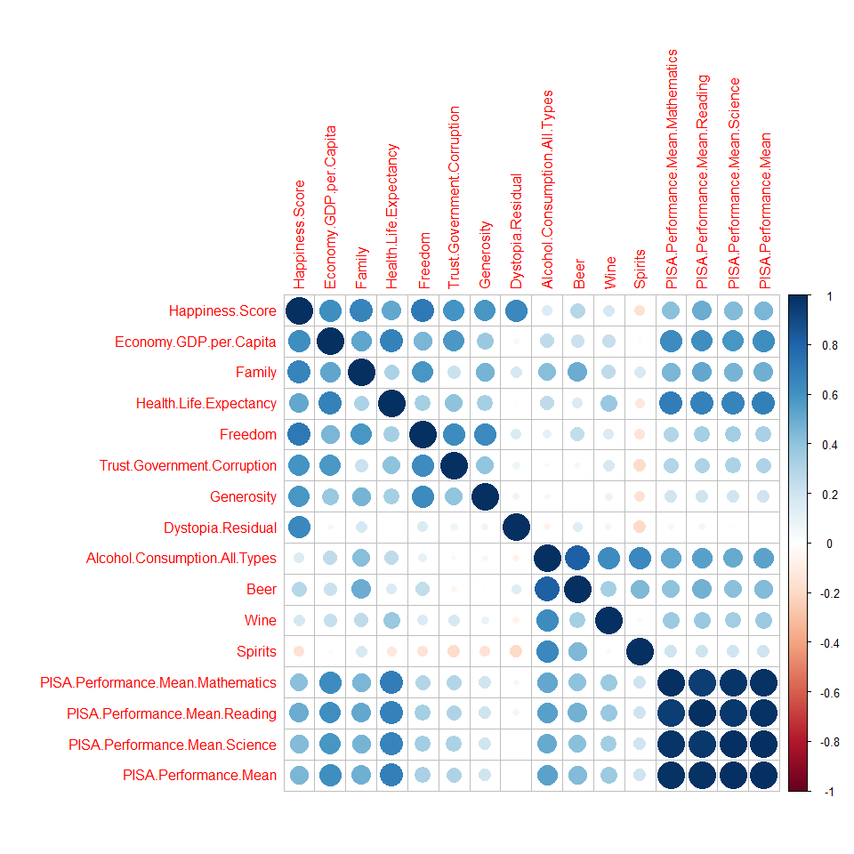
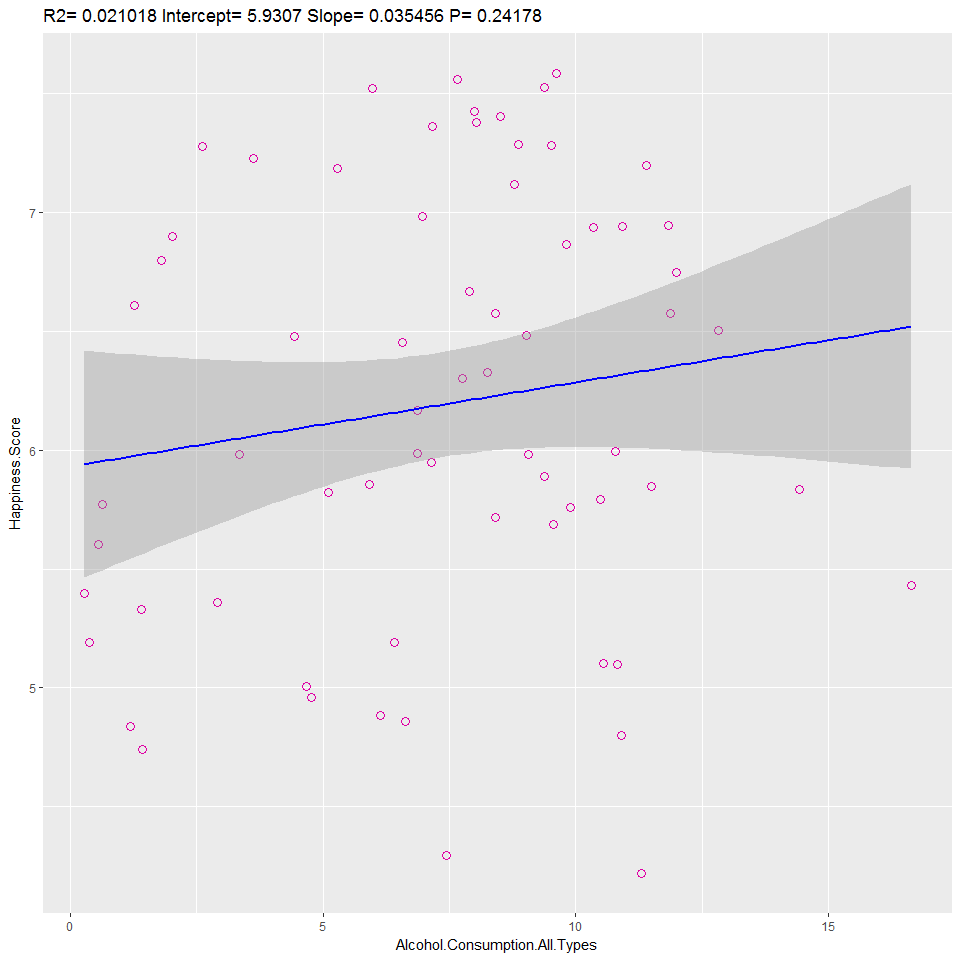
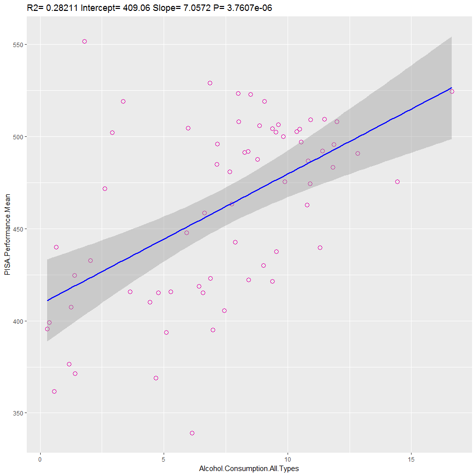
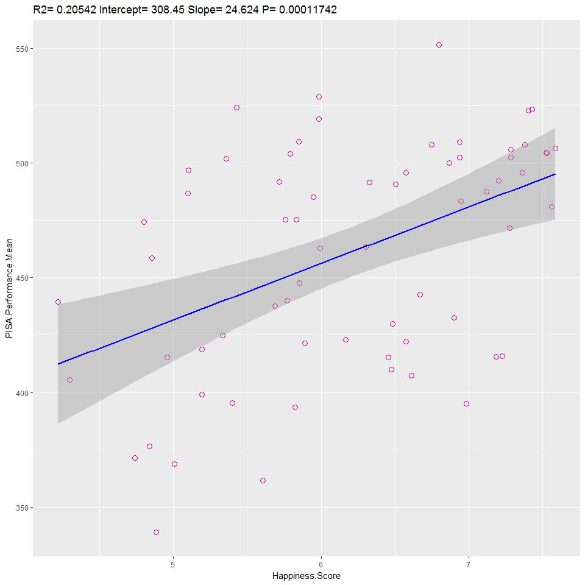

> rmarkdown::render('../IT_Project/data/Regression_Analysis.Rmd', output_format = 'html_document')


## Setup

### Load Libraries 

-- Load Library for reading CSV Files.
-- Load tidyr-library
-- Load dplyr-library


```r
library(csvread)
library(dplyr)
library(ggplot2)
library(corrplot)
library(knitr)
```
### Read data


```r
data <- read.csv("../data/master_data/master_data.csv")
data
```

-- Select relevant columns for correlation


```r
corr_data <- dplyr::select(data, Country, Happiness.Score, Economy.GDP.per.Capita, Family, Health.Life.Expectancy,Freedom, Trust.Government.Corruption, Generosity, Dystopia.Residual,Alcohol.Consumption.All.Types,Beer, Wine, Spirits, contains("PISA"))

corr_data
```

<div data-pagedtable="false">
  <script data-pagedtable-source type="application/json">
{"columns":[{"label":["Country"],"name":[1],"type":["fctr"],"align":["left"]},{"label":["Happiness.Score"],"name":[2],"type":["dbl"],"align":["right"]},{"label":["Economy.GDP.per.Capita"],"name":[3],"type":["dbl"],"align":["right"]},{"label":["Family"],"name":[4],"type":["dbl"],"align":["right"]},{"label":["Health.Life.Expectancy"],"name":[5],"type":["dbl"],"align":["right"]},{"label":["Freedom"],"name":[6],"type":["dbl"],"align":["right"]},{"label":["Trust.Government.Corruption"],"name":[7],"type":["dbl"],"align":["right"]},{"label":["Generosity"],"name":[8],"type":["dbl"],"align":["right"]},{"label":["Dystopia.Residual"],"name":[9],"type":["dbl"],"align":["right"]},{"label":["Alcohol.Consumption.All.Types"],"name":[10],"type":["dbl"],"align":["right"]},{"label":["Beer"],"name":[11],"type":["dbl"],"align":["right"]},{"label":["Wine"],"name":[12],"type":["dbl"],"align":["right"]},{"label":["Spirits"],"name":[13],"type":["dbl"],"align":["right"]},{"label":["PISA.Performance.Mean.Mathematics"],"name":[14],"type":["dbl"],"align":["right"]},{"label":["PISA.Performance.Mean.Reading"],"name":[15],"type":["dbl"],"align":["right"]},{"label":["PISA.Performance.Mean.Science"],"name":[16],"type":["dbl"],"align":["right"]},{"label":["PISA.Performance.Mean"],"name":[17],"type":["dbl"],"align":["right"]}],"data":[{"1":"Albania","2":"4.959","3":"0.87867","4":"0.80434","5":"0.81325","6":"0.35733","7":"0.06413","8":"0.14272","9":"1.89894","10":"4.77","11":"1.57","12":"1.17","13":"1.94","14":"413.1570","15":"405.2588","16":"427.2250","17":"415.2136"},{"1":"Algeria","2":"5.605","3":"0.93929","4":"1.07772","5":"0.61766","6":"0.28579","7":"0.17383","8":"0.07822","9":"2.43209","10":"0.56","11":"0.31","12":"0.14","13":"0.10","14":"359.6062","15":"349.8593","16":"375.7451","17":"361.7369"},{"1":"Argentina","2":"6.574","3":"1.05351","4":"1.24823","5":"0.78723","6":"0.44974","7":"0.08484","8":"0.11451","9":"2.83600","10":"8.42","11":"3.36","12":"3.38","13":"0.81","14":"409.0333","15":"425.3031","16":"432.2262","17":"422.1875"},{"1":"Australia","2":"7.284","3":"1.33358","4":"1.30923","5":"0.93156","6":"0.65124","7":"0.35637","8":"0.43562","9":"2.26646","10":"9.52","11":"3.76","12":"3.66","13":"1.22","14":"493.8962","15":"502.9006","16":"509.9939","17":"502.2636"},{"1":"Austria","2":"7.200","3":"1.33723","4":"1.29704","5":"0.89042","6":"0.62433","7":"0.18676","8":"0.33088","9":"2.53320","10":"11.40","11":"6.10","12":"3.60","13":"1.70","14":"496.7423","15":"484.8656","16":"495.0375","17":"492.2151"},{"1":"Belgium","2":"6.937","3":"1.30782","4":"1.28566","5":"0.89667","6":"0.58450","7":"0.22540","8":"0.22250","9":"2.41484","10":"10.36","11":"4.60","12":"3.97","13":"1.47","14":"506.9844","15":"498.5242","16":"501.9997","17":"502.5028"},{"1":"Brazil","2":"6.983","3":"0.98124","4":"1.23287","5":"0.69702","6":"0.49049","7":"0.17521","8":"0.14574","9":"3.26001","10":"6.97","11":"4.45","12":"0.25","13":"2.24","14":"377.0695","15":"407.3486","16":"400.6821","17":"395.0334"},{"1":"Bulgaria","2":"4.218","3":"1.01216","4":"1.10614","5":"0.76649","6":"0.30587","7":"0.00872","8":"0.11921","9":"0.89991","10":"11.30","11":"4.22","12":"1.96","13":"4.99","14":"441.1899","15":"431.7175","16":"445.7720","17":"439.5598"},{"1":"Canada","2":"7.427","3":"1.32629","4":"1.32261","5":"0.90563","6":"0.63297","7":"0.32957","8":"0.45811","9":"2.45176","10":"8.00","11":"3.70","12":"2.00","13":"2.00","14":"515.6474","15":"526.6678","16":"527.7047","17":"523.3400"},{"1":"Chile","2":"6.670","3":"1.10715","4":"1.12447","5":"0.85857","6":"0.44132","7":"0.12869","8":"0.33363","9":"2.67585","10":"7.89","11":"2.85","12":"2.61","13":"2.43","14":"422.6714","15":"458.5709","16":"446.9561","17":"442.7328"},{"1":"Colombia","2":"6.477","3":"0.91861","4":"1.24018","5":"0.69077","6":"0.53466","7":"0.05120","8":"0.18401","9":"2.85737","10":"4.43","11":"3.13","12":"0.05","13":"1.23","14":"389.6438","15":"424.9052","16":"415.7288","17":"410.0926"},{"1":"Costa Rica","2":"7.226","3":"0.95578","4":"1.23788","5":"0.86027","6":"0.63376","7":"0.10583","8":"0.25497","9":"3.17728","10":"3.63","11":"2.31","12":"0.27","13":"1.02","14":"400.2534","15":"427.4875","16":"419.6080","17":"415.7830"},{"1":"Croatia","2":"5.759","3":"1.08254","4":"0.79624","5":"0.78805","6":"0.25883","7":"0.02430","8":"0.05444","9":"2.75414","10":"9.89","11":"4.50","12":"3.68","13":"1.34","14":"464.0401","15":"486.8632","16":"475.3912","17":"475.4315"},{"1":"Cyprus","2":"5.689","3":"1.20813","4":"0.89318","5":"0.92356","6":"0.40672","7":"0.06146","8":"0.30638","9":"1.88931","10":"9.55","11":"2.84","12":"2.71","13":"4.00","14":"437.1443","15":"442.8443","16":"432.5964","17":"437.5283"},{"1":"Czech Republic","2":"6.505","3":"1.17898","4":"1.20643","5":"0.84483","6":"0.46364","7":"0.02652","8":"0.10686","9":"2.67782","10":"12.82","11":"6.90","12":"2.67","13":"3.25","14":"492.3254","15":"487.2501","16":"492.8300","17":"490.8018"},{"1":"Denmark","2":"7.527","3":"1.32548","4":"1.36058","5":"0.87464","6":"0.64938","7":"0.48357","8":"0.34139","9":"2.49204","10":"9.38","11":"3.49","12":"4.21","13":"1.68","14":"511.0876","15":"499.8146","16":"501.9369","17":"504.2797"},{"1":"Dominican Republic","2":"4.885","3":"0.89537","4":"1.17202","5":"0.66825","6":"0.57672","7":"0.14234","8":"0.21684","9":"1.21305","10":"6.14","11":"3.49","12":"0.24","13":"2.34","14":"327.7020","15":"357.7377","16":"331.6388","17":"339.0262"},{"1":"Estonia","2":"5.429","3":"1.15174","4":"1.22791","5":"0.77361","6":"0.44888","7":"0.15184","8":"0.08680","9":"1.58782","10":"16.64","11":"5.44","12":"1.23","13":"8.37","14":"519.5291","15":"519.1429","16":"534.1937","17":"524.2886"},{"1":"Finland","2":"7.406","3":"1.29025","4":"1.31826","5":"0.88911","6":"0.64169","7":"0.41372","8":"0.23351","9":"2.61955","10":"8.51","11":"4.13","12":"1.75","13":"1.84","14":"511.0769","15":"526.4247","16":"530.6612","17":"522.7209"},{"1":"France","2":"6.575","3":"1.27778","4":"1.26038","5":"0.94579","6":"0.55011","7":"0.20646","8":"0.12332","9":"2.21126","10":"11.87","11":"2.16","12":"7.09","13":"2.42","14":"492.9204","15":"499.3061","16":"494.9776","17":"495.7347"},{"1":"Georgia","2":"4.297","3":"0.74190","4":"0.38562","5":"0.72926","6":"0.40577","7":"0.38331","8":"0.05547","9":"1.59541","10":"7.44","11":"1.37","12":"3.10","13":"2.97","14":"403.8332","15":"401.2881","16":"411.1315","17":"405.4176"},{"1":"Germany","2":"6.750","3":"1.32792","4":"1.29937","5":"0.89186","6":"0.61477","7":"0.21843","8":"0.28214","9":"2.11569","10":"11.99","11":"5.66","12":"3.84","13":"2.49","14":"505.9713","15":"509.1041","16":"509.1406","17":"508.0720"},{"1":"Greece","2":"4.857","3":"1.15406","4":"0.92933","5":"0.88213","6":"0.07699","7":"0.01397","8":"0.00000","9":"1.80101","10":"6.64","11":"2.04","12":"3.08","13":"1.44","14":"453.6299","15":"467.0395","16":"454.8288","17":"458.4994"},{"1":"Hungary","2":"4.800","3":"1.12094","4":"1.20215","5":"0.75905","6":"0.32112","7":"0.02758","8":"0.12800","9":"1.24074","10":"10.90","11":"3.93","12":"3.41","13":"3.57","14":"476.8309","15":"469.5233","16":"476.7475","17":"474.3672"},{"1":"Iceland","2":"7.561","3":"1.30232","4":"1.40223","5":"0.94784","6":"0.62877","7":"0.14145","8":"0.43630","9":"2.70201","10":"7.66","11":"4.26","12":"2.15","13":"1.25","14":"488.0332","15":"481.5255","16":"473.2301","17":"480.9296"},{"1":"Indonesia","2":"5.399","3":"0.82827","4":"1.08708","5":"0.63793","6":"0.46611","7":"0.00000","8":"0.51535","9":"1.86399","10":"0.28","11":"0.05","12":"0.22","13":"0.01","14":"386.1096","15":"397.2595","16":"403.0997","17":"395.4896"},{"1":"Ireland","2":"6.940","3":"1.33596","4":"1.36948","5":"0.89533","6":"0.61777","7":"0.28703","8":"0.45901","9":"1.97570","10":"10.93","11":"5.14","12":"3.06","13":"1.97","14":"503.7220","15":"520.8148","16":"502.5751","17":"509.0373"},{"1":"Israel","2":"7.278","3":"1.22857","4":"1.22393","5":"0.91387","6":"0.41319","7":"0.07785","8":"0.33172","9":"3.08854","10":"2.61","11":"1.41","12":"0.11","13":"1.05","14":"469.6695","15":"478.9606","16":"466.5528","17":"471.7276"},{"1":"Italy","2":"5.948","3":"1.25114","4":"1.19777","5":"0.95446","6":"0.26236","7":"0.02901","8":"0.22823","9":"2.02518","10":"7.14","11":"1.78","12":"4.61","13":"0.74","14":"489.7287","15":"484.7580","16":"480.5468","17":"485.0112"},{"1":"Japan","2":"5.987","3":"1.27074","4":"1.25712","5":"0.99111","6":"0.49615","7":"0.18060","8":"0.10705","9":"1.68435","10":"6.86","11":"1.25","12":"0.38","13":"2.74","14":"532.4399","15":"515.9585","16":"538.3948","17":"528.9311"},{"1":"Jordan","2":"5.192","3":"0.90198","4":"1.05392","5":"0.69639","6":"0.40661","7":"0.14293","8":"0.11053","9":"1.87996","10":"0.37","11":"0.07","12":"0.01","13":"0.29","14":"380.2590","15":"408.1022","16":"408.6691","17":"399.0101"},{"1":"Kazakhstan","2":"5.855","3":"1.12254","4":"1.12241","5":"0.64368","6":"0.51649","7":"0.08454","8":"0.11827","9":"2.24729","10":"5.92","11":"1.78","12":"0.38","13":"3.76","14":"459.8160","15":"427.1410","16":"456.4836","17":"447.8135"},{"1":"Latvia","2":"5.098","3":"1.11312","4":"1.09562","5":"0.72437","6":"0.29671","7":"0.06332","8":"0.18226","9":"1.62215","10":"10.82","11":"4.80","12":"1.24","13":"4.13","14":"482.3051","15":"487.7581","16":"490.2250","17":"486.7627"},{"1":"Lebanon","2":"4.839","3":"1.02564","4":"0.80001","5":"0.83947","6":"0.33916","7":"0.04582","8":"0.21854","9":"1.57059","10":"1.18","11":"0.38","12":"0.19","13":"0.59","14":"396.2497","15":"346.5490","16":"386.4854","17":"376.4280"},{"1":"Lithuania","2":"5.833","3":"1.14723","4":"1.25745","5":"0.73128","6":"0.21342","7":"0.01031","8":"0.02641","9":"2.44649","10":"14.42","11":"6.28","12":"1.03","13":"5.35","14":"478.3834","15":"472.4066","16":"475.4089","17":"475.3996"},{"1":"Luxembourg","2":"6.946","3":"1.56391","4":"1.21963","5":"0.91894","6":"0.61583","7":"0.37798","8":"0.28034","9":"1.96961","10":"11.83","11":"3.91","12":"5.47","13":"2.46","14":"485.7706","15":"481.4391","16":"482.8064","17":"483.3387"},{"1":"Macedonia","2":"5.007","3":"0.91851","4":"1.00232","5":"0.73545","6":"0.33457","7":"0.05327","8":"0.22359","9":"1.73933","10":"4.68","11":"1.67","12":"2.15","13":"0.84","14":"371.3114","15":"351.7415","16":"383.6824","17":"368.9118"},{"1":"Malaysia","2":"5.770","3":"1.12486","4":"1.07023","5":"0.72394","6":"0.53024","7":"0.10501","8":"0.33075","9":"1.88541","10":"0.64","11":"0.39","12":"0.13","13":"0.11","14":"446.1098","15":"430.5782","16":"442.9475","17":"439.8785"},{"1":"Malta","2":"6.302","3":"1.20740","4":"1.30203","5":"0.88721","6":"0.60365","7":"0.13586","8":"0.51752","9":"1.64880","10":"7.75","11":"2.96","12":"2.21","13":"2.16","14":"478.6448","15":"446.6661","16":"464.7819","17":"463.3643"},{"1":"Mexico","2":"7.187","3":"1.02054","4":"0.91451","5":"0.81444","6":"0.48181","7":"0.21312","8":"0.14074","9":"3.60214","10":"5.28","11":"4.01","12":"0.11","13":"1.14","14":"408.0235","15":"423.2765","16":"415.7099","17":"415.6700"},{"1":"Moldova","2":"5.889","3":"0.59448","4":"1.01528","5":"0.61826","6":"0.32818","7":"0.01615","8":"0.20951","9":"3.10712","10":"9.39","11":"1.52","12":"5.25","13":"2.43","14":"419.6635","15":"416.2293","16":"427.9978","17":"421.2969"},{"1":"Montenegro","2":"5.192","3":"0.97438","4":"0.90557","5":"0.72521","6":"0.18260","7":"0.14296","8":"0.16140","9":"2.10017","10":"6.41","11":"0.69","12":"2.76","13":"2.83","14":"417.9341","15":"426.8845","16":"411.3136","17":"418.7107"},{"1":"Netherlands","2":"7.378","3":"1.32944","4":"1.28017","5":"0.89284","6":"0.61576","7":"0.31814","8":"0.47610","9":"2.46570","10":"8.03","11":"3.83","12":"2.88","13":"1.32","14":"512.2528","15":"502.9591","16":"508.5748","17":"507.9289"},{"1":"New Zealand","2":"7.286","3":"1.25018","4":"1.31967","5":"0.90837","6":"0.63938","7":"0.42922","8":"0.47501","9":"2.26425","10":"8.87","11":"3.35","12":"2.97","13":"2.53","14":"495.2233","15":"509.2707","16":"513.3035","17":"505.9325"},{"1":"Norway","2":"7.522","3":"1.45900","4":"1.33095","5":"0.88521","6":"0.66973","7":"0.36503","8":"0.34699","9":"2.46531","10":"5.97","11":"2.57","12":"2.22","13":"1.03","14":"501.7298","15":"513.1912","16":"498.4811","17":"504.4674"},{"1":"Peru","2":"5.824","3":"0.90019","4":"0.97459","5":"0.73017","6":"0.41496","7":"0.05989","8":"0.14982","9":"2.59450","10":"5.10","11":"3.06","12":"0.41","13":"1.62","14":"386.5606","15":"397.5414","16":"396.6836","17":"393.5952"},{"1":"Poland","2":"5.791","3":"1.12555","4":"1.27948","5":"0.77903","6":"0.53122","7":"0.04212","8":"0.16759","9":"1.86565","10":"10.48","11":"5.83","12":"0.89","13":"3.76","14":"504.4693","15":"505.6971","16":"501.4353","17":"503.8672"},{"1":"Portugal","2":"5.102","3":"1.15991","4":"1.13935","5":"0.87519","6":"0.51469","7":"0.01078","8":"0.13719","9":"1.26462","10":"10.54","11":"2.69","12":"6.54","13":"0.82","14":"491.6270","15":"498.1289","16":"501.1001","17":"496.9520"},{"1":"Qatar","2":"6.611","3":"1.69042","4":"1.07860","5":"0.79733","6":"0.64040","7":"0.52208","8":"0.32573","9":"1.55674","10":"1.26","11":"0.33","12":"0.13","13":"0.79","14":"402.4007","15":"401.8874","16":"417.6112","17":"407.2998"},{"1":"Republic of Korea","2":"5.984","3":"1.24461","4":"0.95774","5":"0.96538","6":"0.33208","7":"0.07857","8":"0.18557","9":"2.21978","10":"9.06","11":"2.01","12":"0.17","13":"0.64","14":"524.1062","15":"517.4367","16":"515.8099","17":"519.1176"},{"1":"Republic of Korea","2":"5.984","3":"1.24461","4":"0.95774","5":"0.96538","6":"0.33208","7":"0.07857","8":"0.18557","9":"2.21978","10":"3.35","11":"0.09","12":"0.00","13":"3.26","14":"524.1062","15":"517.4367","16":"515.8099","17":"519.1176"},{"1":"Russian Federation","2":"5.716","3":"1.13764","4":"1.23617","5":"0.66926","6":"0.36679","7":"0.03005","8":"0.00199","9":"2.27394","10":"8.41","11":"3.49","12":"0.87","13":"3.36","14":"494.0600","15":"494.6278","16":"486.6310","17":"491.7729"},{"1":"Singapore","2":"6.798","3":"1.52186","4":"1.02000","5":"1.02525","6":"0.54252","7":"0.49210","8":"0.31105","9":"1.88501","10":"1.80","11":"1.25","12":"0.27","13":"0.25","14":"564.1897","15":"535.1002","16":"555.5747","17":"551.6215"},{"1":"Slovakia","2":"5.995","3":"1.16891","4":"1.26999","5":"0.78902","6":"0.31751","7":"0.03431","8":"0.16893","9":"2.24639","10":"10.78","11":"3.44","12":"2.61","13":"4.27","14":"475.2301","15":"452.5143","16":"460.7749","17":"462.8398"},{"1":"Slovenia","2":"5.848","3":"1.18498","4":"1.27385","5":"0.87337","6":"0.60855","7":"0.03787","8":"0.25328","9":"1.61583","10":"11.49","11":"5.73","12":"4.90","13":"0.86","14":"509.9196","15":"505.2159","16":"512.8636","17":"509.3330"},{"1":"Spain","2":"6.329","3":"1.23011","4":"1.31379","5":"0.95562","6":"0.45951","7":"0.06398","8":"0.18227","9":"2.12367","10":"8.26","11":"4.51","12":"1.55","13":"2.21","14":"485.8432","15":"495.5764","16":"492.7861","17":"491.4019"},{"1":"Sweden","2":"7.364","3":"1.33171","4":"1.28907","5":"0.91087","6":"0.65980","7":"0.43844","8":"0.36262","9":"2.37119","10":"7.16","11":"2.62","12":"3.42","13":"1.01","14":"493.9181","15":"500.1556","16":"493.4224","17":"495.8320"},{"1":"Switzerland","2":"7.587","3":"1.39651","4":"1.34951","5":"0.94143","6":"0.66557","7":"0.41978","8":"0.29678","9":"2.51738","10":"9.62","11":"3.17","12":"4.58","13":"1.76","14":"521.2506","15":"492.1982","16":"505.5058","17":"506.3182"},{"1":"Thailand","2":"6.455","3":"0.96690","4":"1.26504","5":"0.73850","6":"0.55664","7":"0.03187","8":"0.57630","9":"2.31945","10":"6.57","11":"1.86","12":"0.18","13":"4.53","14":"415.4638","15":"409.1301","16":"421.3373","17":"415.3104"},{"1":"Trinidad and Tobago","2":"6.168","3":"1.21183","4":"1.18354","5":"0.61483","6":"0.55884","7":"0.01140","8":"0.31844","9":"2.26882","10":"6.87","11":"3.73","12":"0.25","13":"2.77","14":"417.2434","15":"427.2733","16":"424.5905","17":"423.0357"},{"1":"Tunisia","2":"4.739","3":"0.88113","4":"0.60429","5":"0.73793","6":"0.26268","7":"0.06358","8":"0.06431","9":"2.12466","10":"1.42","11":"1.04","12":"0.33","13":"0.05","14":"366.8180","15":"361.0555","16":"386.4034","17":"371.4256"},{"1":"Turkey","2":"5.332","3":"1.06098","4":"0.94632","5":"0.73172","6":"0.22815","7":"0.15746","8":"0.12253","9":"2.08528","10":"1.40","11":"0.80","12":"0.13","13":"0.47","14":"420.4540","15":"428.3351","16":"425.4895","17":"424.7595"},{"1":"United Arab Emirates","2":"6.901","3":"1.42727","4":"1.12575","5":"0.80925","6":"0.64157","7":"0.38583","8":"0.26428","9":"2.24743","10":"2.03","11":"0.21","12":"0.14","13":"1.68","14":"427.4827","15":"433.5423","16":"436.7311","17":"432.5854"},{"1":"United Kingdom","2":"6.867","3":"1.26637","4":"1.28548","5":"0.90943","6":"0.59625","7":"0.32067","8":"0.51912","9":"1.96994","10":"9.82","11":"3.49","12":"3.48","13":"2.13","14":"492.4785","15":"497.9719","16":"509.2215","17":"499.8906"},{"1":"United States","2":"7.119","3":"1.39451","4":"1.24711","5":"0.86179","6":"0.54604","7":"0.15890","8":"0.40105","9":"2.51011","10":"8.78","11":"4.13","12":"1.59","13":"3.07","14":"469.6285","15":"496.9351","16":"496.2424","17":"487.6020"},{"1":"Uruguay","2":"6.485","3":"1.06166","4":"1.20890","5":"0.81160","6":"0.60362","7":"0.24558","8":"0.23240","9":"2.32142","10":"9.03","11":"3.18","12":"3.94","13":"1.91","14":"417.9919","15":"436.5721","16":"435.3630","17":"429.9757"},{"1":"Vietnam","2":"5.360","3":"0.63216","4":"0.91226","5":"0.74676","6":"0.59444","7":"0.10441","8":"0.16860","9":"2.20173","10":"2.92","11":"2.67","12":"0.02","13":"0.23","14":"494.5183","15":"486.7738","16":"524.6445","17":"501.9789"}],"options":{"columns":{"min":{},"max":[10]},"rows":{"min":[10],"max":[10]},"pages":{}}}
  </script>
</div>

-- Perform Correlation


```r
summary(cor(corr_data[,2:17]))
```

```
##  Happiness.Score   Economy.GDP.per.Capita     Family      
##  Min.   :-0.1585   Min.   :-0.04371       Min.   :0.1678  
##  1st Qu.: 0.3816   1st Qu.: 0.24864       1st Qu.:0.2963  
##  Median : 0.5037   Median : 0.54887       Median :0.4625  
##  Mean   : 0.4728   Mean   : 0.45894       Mean   :0.4501  
##  3rd Qu.: 0.6226   3rd Qu.: 0.61434       3rd Qu.:0.5168  
##  Max.   : 1.0000   Max.   : 1.00000       Max.   :1.0000  
##  Health.Life.Expectancy    Freedom        Trust.Government.Corruption
##  Min.   :-0.1204        Min.   :-0.1405   Min.   :-0.1889            
##  1st Qu.: 0.2961        1st Qu.: 0.2244   1st Qu.: 0.1480            
##  Median : 0.3890        Median : 0.3363   Median : 0.3067            
##  Mean   : 0.4360        Mean   : 0.3856   Mean   : 0.3126            
##  3rd Qu.: 0.6759        3rd Qu.: 0.5924   3rd Qu.: 0.4488            
##  Max.   : 1.0000        Max.   : 1.0000   Max.   : 1.0000            
##    Generosity       Dystopia.Residual  Alcohol.Consumption.All.Types
##  Min.   :-0.15803   Min.   :-0.19315   Min.   :-0.06092             
##  1st Qu.: 0.07963   1st Qu.:-0.04568   1st Qu.: 0.13396             
##  Median : 0.20456   Median : 0.03656   Median : 0.46546             
##  Mean   : 0.28469   Mean   : 0.11838   Mean   : 0.38902             
##  3rd Qu.: 0.41421   3rd Qu.: 0.13879   3rd Qu.: 0.56866             
##  Max.   : 1.00000   Max.   : 1.00000   Max.   : 1.00000             
##       Beer               Wine             Spirits       
##  Min.   :-0.05449   Min.   :-0.06673   Min.   :-0.1932  
##  1st Qu.: 0.20268   1st Qu.: 0.16710   1st Qu.:-0.1449  
##  Median : 0.36671   Median : 0.29152   Median : 0.1029  
##  Mean   : 0.36312   Mean   : 0.30213   Mean   : 0.1354  
##  3rd Qu.: 0.45173   3rd Qu.: 0.36759   3rd Qu.: 0.2042  
##  Max.   : 1.00000   Max.   : 1.00000   Max.   : 1.0000  
##  PISA.Performance.Mean.Mathematics PISA.Performance.Mean.Reading
##  Min.   :-0.0516                   Min.   :0.05804              
##  1st Qu.: 0.2970                   1st Qu.:0.32941              
##  Median : 0.4363                   Median :0.50392              
##  Mean   : 0.5204                   Mean   :0.54346              
##  3rd Qu.: 0.7564                   3rd Qu.:0.74639              
##  Max.   : 1.0000                   Max.   :1.00000              
##  PISA.Performance.Mean.Science PISA.Performance.Mean
##  Min.   :-0.01683              Min.   :-0.004144    
##  1st Qu.: 0.33453              1st Qu.: 0.323908    
##  Median : 0.44815              Median : 0.468523    
##  Mean   : 0.52385              Mean   : 0.536014    
##  3rd Qu.: 0.74259              3rd Qu.: 0.762850    
##  Max.   : 1.00000              Max.   : 1.000000
```

```r
corrplot(cor(corr_data[,2:17]))
```

<!-- -->

Interpretation


```r
pisa.alcohol.lm <- lm(PISA.Performance.Mean ~Beer + Wine+ Spirits+Other, data)
summary(pisa.alcohol.lm)
```

```
## 
## Call:
## lm(formula = PISA.Performance.Mean ~ Beer + Wine + Spirits + 
##     Other, data = data)
## 
## Residuals:
##      Min       1Q   Median       3Q      Max 
## -106.908  -25.682   -0.375   25.652  127.035 
## 
## Coefficients:
##             Estimate Std. Error t value Pr(>|t|)    
## (Intercept) 410.7483    11.7211  35.044  < 2e-16 ***
## Beer          8.7301     3.8290   2.280  0.02630 *  
## Wine          8.2333     3.1422   2.620  0.01120 *  
## Spirits       0.6274     4.0711   0.154  0.87806    
## Other        18.1966     6.1872   2.941  0.00469 ** 
## ---
## Signif. codes:  0 '***' 0.001 '**' 0.01 '*' 0.05 '.' 0.1 ' ' 1
## 
## Residual standard error: 42.57 on 58 degrees of freedom
##   (4 observations deleted due to missingness)
## Multiple R-squared:  0.3385,	Adjusted R-squared:  0.2929 
## F-statistic: 7.419 on 4 and 58 DF,  p-value: 6.758e-05
```

```r
pisa.alcohol2.lm <- lm(PISA.Performance.Mean ~Alcohol.Consumption.All.Types, data)
summary(pisa.alcohol2.lm)
```

```
## 
## Call:
## lm(formula = PISA.Performance.Mean ~ Alcohol.Consumption.All.Types, 
##     data = data)
## 
## Residuals:
##      Min       1Q   Median       3Q      Max 
## -113.363  -32.578    1.346   24.808  129.861 
## 
## Coefficients:
##                               Estimate Std. Error t value Pr(>|t|)    
## (Intercept)                    409.058     11.481  35.629  < 2e-16 ***
## Alcohol.Consumption.All.Types    7.057      1.396   5.054 3.76e-06 ***
## ---
## Signif. codes:  0 '***' 0.001 '**' 0.01 '*' 0.05 '.' 0.1 ' ' 1
## 
## Residual standard error: 42.2 on 65 degrees of freedom
## Multiple R-squared:  0.2821,	Adjusted R-squared:  0.2711 
## F-statistic: 25.54 on 1 and 65 DF,  p-value: 3.761e-06
```

```r
pisa.happiness.lm <- lm(PISA.Performance.Mean~Happiness.Score, data)
summary(pisa.happiness.lm)
```

```
## 
## Call:
## lm(formula = PISA.Performance.Mean ~ Happiness.Score, data = data)
## 
## Residuals:
##    Min     1Q Median     3Q    Max 
## -89.71 -37.29   6.47  29.89  82.15 
## 
## Coefficients:
##                 Estimate Std. Error t value Pr(>|t|)    
## (Intercept)      308.453     37.583   8.207 1.25e-11 ***
## Happiness.Score   24.624      6.007   4.099 0.000117 ***
## ---
## Signif. codes:  0 '***' 0.001 '**' 0.01 '*' 0.05 '.' 0.1 ' ' 1
## 
## Residual standard error: 44.4 on 65 degrees of freedom
## Multiple R-squared:  0.2054,	Adjusted R-squared:  0.1932 
## F-statistic:  16.8 on 1 and 65 DF,  p-value: 0.0001174
```

```r
happiness.alcohol.lm<-lm(Happiness.Score ~ Alcohol.Consumption.All.Types, data)
summary(happiness.alcohol.lm)
```

```
## 
## Call:
## lm(formula = Happiness.Score ~ Alcohol.Consumption.All.Types, 
##     data = data)
## 
## Residuals:
##      Min       1Q   Median       3Q      Max 
## -2.11333 -0.59461 -0.00626  0.80435  1.37965 
## 
## Coefficients:
##                               Estimate Std. Error t value Pr(>|t|)    
## (Intercept)                    5.93068    0.24678  24.033   <2e-16 ***
## Alcohol.Consumption.All.Types  0.03546    0.03001   1.181    0.242    
## ---
## Signif. codes:  0 '***' 0.001 '**' 0.01 '*' 0.05 '.' 0.1 ' ' 1
## 
## Residual standard error: 0.9071 on 65 degrees of freedom
## Multiple R-squared:  0.02102,	Adjusted R-squared:  0.005957 
## F-statistic: 1.396 on 1 and 65 DF,  p-value: 0.2418
```

```r
pisa.economy.lm <- lm(PISA.Performance.Mean ~ Economy.GDP.per.Capita , data)
summary(pisa.economy.lm)
```

```
## 
## Call:
## lm(formula = PISA.Performance.Mean ~ Economy.GDP.per.Capita, 
##     data = data)
## 
## Residuals:
##      Min       1Q   Median       3Q      Max 
## -131.874  -18.734   -0.432   23.354  116.358 
## 
## Coefficients:
##                        Estimate Std. Error t value Pr(>|t|)    
## (Intercept)              293.90      27.09  10.848 3.17e-16 ***
## Economy.GDP.per.Capita   145.10      23.17   6.264 3.39e-08 ***
## ---
## Signif. codes:  0 '***' 0.001 '**' 0.01 '*' 0.05 '.' 0.1 ' ' 1
## 
## Residual standard error: 39.34 on 65 degrees of freedom
## Multiple R-squared:  0.3764,	Adjusted R-squared:  0.3668 
## F-statistic: 39.23 on 1 and 65 DF,  p-value: 3.393e-08
```

Interpretation:

High levels of significance point to positive relationships between our chosen variables:

-- Different kinds of alcohol (Beer, Wine and Others especially) are significant predictor variables for the average PISA performance.
-- Alcohol consumption in general is a significant predictor variable for the average PISA performance.
-- The Happiness Score is a significant predictor for the average PISA performance.

However one has to consider the low levels of R-square in all of the aforementioned regressions. This means that, although the low P values indicate a real relationship between predictors and response variables, the precision of the prediction is not very high on all accounts.
This can be led to the fact, that our data is very processed, on the one hand Happiness Score being a highly calculated variable and on the other having average scores for entire countries, rather than single oberservation variables. 


Lack of significance for the relationship between Happiness Score and Alcohol Consumption. 


```r
plotRegression <- function(para){
  ggplot(para$model, aes_string(x=names(para$model)[2], y=names(para$model)[1]))+
    geom_point(shape=1, size=3, color="#DF01A5")+
    stat_smooth(method="lm", col="blue")+
    labs(title=paste("R2=", signif(summary(para)$r.squared,5),
                     "Intercept=", signif(para$coef[[1]],5),
                     "Slope=", signif(para$coef[[2]],5),
                     "P=",signif(summary(para)$coef[2,4],5)))
}

plot1<-plotRegression(lm(Happiness.Score~Alcohol.Consumption.All.Types, data))

plot3<-plotRegression(lm(PISA.Performance.Mean~Alcohol.Consumption.All.Types, data))
plot6<-plotRegression(lm(PISA.Performance.Mean~Happiness.Score, data))

plot1
```

<!-- -->

```r
plot3
```

<!-- -->

```r
plot6
```

<!-- -->

