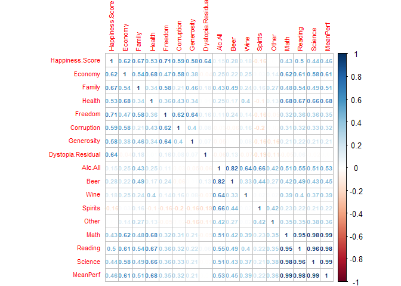
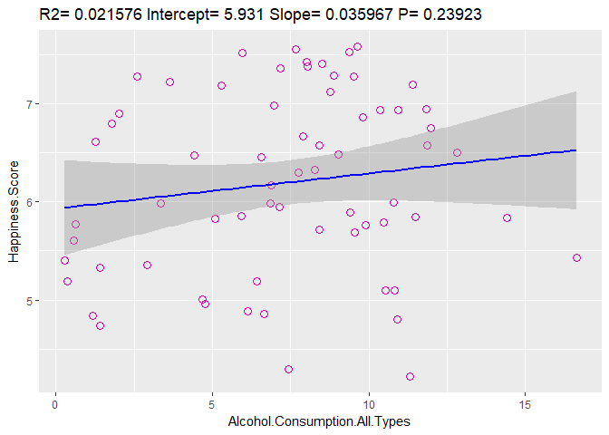
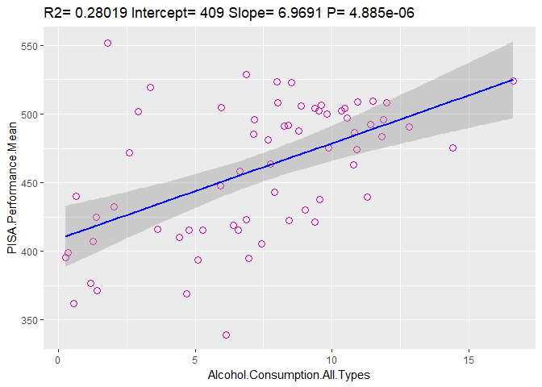

rmarkdown::render('../IT_Project/data/Regression_Analysis.Rmd', output_format = 'html_document')


## Setup

#### Correlation and Regression Analysis

Now we want to find out how our chosen datasets correlate with each other and, if yes, whether the correlations are of significance. Therefore we will firstly perform a correlation analysis between all relevant variables to get a grasp on their overall relationship. Following that we will pick out the strongest ones to examine in a linear regression analysis. 

### Load Libraries 

-- Load Library for reading CSV Files.
-- Load tidyr-library
-- Load dplyr-library


```
## 
## Attaching package: 'dplyr'
```

```
## The following objects are masked from 'package:stats':
## 
##     filter, lag
```

```
## The following objects are masked from 'package:base':
## 
##     intersect, setdiff, setequal, union
```

```
## corrplot 0.84 loaded
```
### Read data

This will be the data we will work with in the following analysis.
<div data-pagedtable="false">
  <script data-pagedtable-source type="application/json">
{"columns":[{"label":["Country"],"name":[1],"type":["fctr"],"align":["left"]},{"label":["Region"],"name":[2],"type":["fctr"],"align":["left"]},{"label":["Happiness.Score"],"name":[3],"type":["dbl"],"align":["right"]},{"label":["Happiness.Score.Standard.Error"],"name":[4],"type":["dbl"],"align":["right"]},{"label":["Economy.GDP.per.Capita"],"name":[5],"type":["dbl"],"align":["right"]},{"label":["Family"],"name":[6],"type":["dbl"],"align":["right"]},{"label":["Health.Life.Expectancy"],"name":[7],"type":["dbl"],"align":["right"]},{"label":["Freedom"],"name":[8],"type":["dbl"],"align":["right"]},{"label":["Trust.Government.Corruption"],"name":[9],"type":["dbl"],"align":["right"]},{"label":["Generosity"],"name":[10],"type":["dbl"],"align":["right"]},{"label":["Dystopia.Residual"],"name":[11],"type":["dbl"],"align":["right"]},{"label":["PISA.Performance.Mean.Mathematics"],"name":[12],"type":["dbl"],"align":["right"]},{"label":["PISA.Performance.Mean.Reading"],"name":[13],"type":["dbl"],"align":["right"]},{"label":["PISA.Performance.Mean.Science"],"name":[14],"type":["dbl"],"align":["right"]},{"label":["PISA.Performance.Mean"],"name":[15],"type":["dbl"],"align":["right"]},{"label":["Alcohol.Consumption.All.Types"],"name":[16],"type":["dbl"],"align":["right"]},{"label":["Beer"],"name":[17],"type":["dbl"],"align":["right"]},{"label":["Other"],"name":[18],"type":["dbl"],"align":["right"]},{"label":["Spirits"],"name":[19],"type":["dbl"],"align":["right"]},{"label":["Wine"],"name":[20],"type":["dbl"],"align":["right"]}],"data":[{"1":"Albania","2":"Central and Eastern Europe","3":"4.959","4":"0.05013","5":"0.87867","6":"0.80434","7":"0.81325","8":"0.35733","9":"0.06413","10":"0.14272","11":"1.89894","12":"413.1570","13":"405.2588","14":"427.2250","15":"415.2136","16":"4.77","17":"1.57","18":"0.08","19":"1.94","20":"1.17"},{"1":"Algeria","2":"Middle East and Northern Africa","3":"5.605","4":"0.05099","5":"0.93929","6":"1.07772","7":"0.61766","8":"0.28579","9":"0.17383","10":"0.07822","11":"2.43209","12":"359.6062","13":"349.8593","14":"375.7451","15":"361.7369","16":"0.56","17":"0.31","18":"0.00","19":"0.10","20":"0.14"},{"1":"Argentina","2":"Latin America and Caribbean","3":"6.574","4":"0.04612","5":"1.05351","6":"1.24823","7":"0.78723","8":"0.44974","9":"0.08484","10":"0.11451","11":"2.83600","12":"409.0333","13":"425.3031","14":"432.2262","15":"422.1875","16":"8.42","17":"3.36","18":"0.87","19":"0.81","20":"3.38"},{"1":"Australia","2":"Australia and New Zealand","3":"7.284","4":"0.04083","5":"1.33358","6":"1.30923","7":"0.93156","8":"0.65124","9":"0.35637","10":"0.43562","11":"2.26646","12":"493.8962","13":"502.9006","14":"509.9939","15":"502.2636","16":"9.52","17":"3.76","18":"0.88","19":"1.22","20":"3.66"},{"1":"Austria","2":"Western Europe","3":"7.200","4":"0.03751","5":"1.33723","6":"1.29704","7":"0.89042","8":"0.62433","9":"0.18676","10":"0.33088","11":"2.53320","12":"496.7423","13":"484.8656","14":"495.0375","15":"492.2151","16":"11.40","17":"6.10","18":"NA","19":"1.70","20":"3.60"},{"1":"Belgium","2":"Western Europe","3":"6.937","4":"0.03595","5":"1.30782","6":"1.28566","7":"0.89667","8":"0.58450","9":"0.22540","10":"0.22250","11":"2.41484","12":"506.9844","13":"498.5242","14":"501.9997","15":"502.5028","16":"10.36","17":"4.60","18":"0.32","19":"1.47","20":"3.97"},{"1":"Brazil","2":"Latin America and Caribbean","3":"6.983","4":"0.04076","5":"0.98124","6":"1.23287","7":"0.69702","8":"0.49049","9":"0.17521","10":"0.14574","11":"3.26001","12":"377.0695","13":"407.3486","14":"400.6821","15":"395.0334","16":"6.97","17":"4.45","18":"0.03","19":"2.24","20":"0.25"},{"1":"Bulgaria","2":"Central and Eastern Europe","3":"4.218","4":"0.04828","5":"1.01216","6":"1.10614","7":"0.76649","8":"0.30587","9":"0.00872","10":"0.11921","11":"0.89991","12":"441.1899","13":"431.7175","14":"445.7720","15":"439.5598","16":"11.30","17":"4.22","18":"0.13","19":"4.99","20":"1.96"},{"1":"Canada","2":"North America","3":"7.427","4":"0.03553","5":"1.32629","6":"1.32261","7":"0.90563","8":"0.63297","9":"0.32957","10":"0.45811","11":"2.45176","12":"515.6474","13":"526.6678","14":"527.7047","15":"523.3400","16":"8.00","17":"3.70","18":"0.30","19":"2.00","20":"2.00"},{"1":"Chile","2":"Latin America and Caribbean","3":"6.670","4":"0.05800","5":"1.10715","6":"1.12447","7":"0.85857","8":"0.44132","9":"0.12869","10":"0.33363","11":"2.67585","12":"422.6714","13":"458.5709","14":"446.9561","15":"442.7328","16":"7.89","17":"2.85","18":"0.00","19":"2.43","20":"2.61"},{"1":"Colombia","2":"Latin America and Caribbean","3":"6.477","4":"0.05051","5":"0.91861","6":"1.24018","7":"0.69077","8":"0.53466","9":"0.05120","10":"0.18401","11":"2.85737","12":"389.6438","13":"424.9052","14":"415.7288","15":"410.0926","16":"4.43","17":"3.13","18":"0.02","19":"1.23","20":"0.05"},{"1":"Costa Rica","2":"Latin America and Caribbean","3":"7.226","4":"0.04454","5":"0.95578","6":"1.23788","7":"0.86027","8":"0.63376","9":"0.10583","10":"0.25497","11":"3.17728","12":"400.2534","13":"427.4875","14":"419.6080","15":"415.7830","16":"3.63","17":"2.31","18":"0.03","19":"1.02","20":"0.27"},{"1":"Croatia","2":"Central and Eastern Europe","3":"5.759","4":"0.04394","5":"1.08254","6":"0.79624","7":"0.78805","8":"0.25883","9":"0.02430","10":"0.05444","11":"2.75414","12":"464.0401","13":"486.8632","14":"475.3912","15":"475.4315","16":"9.89","17":"4.50","18":"0.36","19":"1.34","20":"3.68"},{"1":"Cyprus","2":"Western Europe","3":"5.689","4":"0.05580","5":"1.20813","6":"0.89318","7":"0.92356","8":"0.40672","9":"0.06146","10":"0.30638","11":"1.88931","12":"437.1443","13":"442.8443","14":"432.5964","15":"437.5283","16":"9.55","17":"2.84","18":"0.00","19":"4.00","20":"2.71"},{"1":"Czech Republic","2":"Central and Eastern Europe","3":"6.505","4":"0.04168","5":"1.17898","6":"1.20643","7":"0.84483","8":"0.46364","9":"0.02652","10":"0.10686","11":"2.67782","12":"492.3254","13":"487.2501","14":"492.8300","15":"490.8018","16":"12.82","17":"6.90","18":"0.00","19":"3.25","20":"2.67"},{"1":"Denmark","2":"Western Europe","3":"7.527","4":"0.03328","5":"1.32548","6":"1.36058","7":"0.87464","8":"0.64938","9":"0.48357","10":"0.34139","11":"2.49204","12":"511.0876","13":"499.8146","14":"501.9369","15":"504.2797","16":"9.38","17":"3.49","18":"0.00","19":"1.68","20":"4.21"},{"1":"Dominican Republic","2":"Latin America and Caribbean","3":"4.885","4":"0.07446","5":"0.89537","6":"1.17202","7":"0.66825","8":"0.57672","9":"0.14234","10":"0.21684","11":"1.21305","12":"327.7020","13":"357.7377","14":"331.6388","15":"339.0262","16":"6.14","17":"3.49","18":"0.07","19":"2.34","20":"0.24"},{"1":"Estonia","2":"Central and Eastern Europe","3":"5.429","4":"0.04013","5":"1.15174","6":"1.22791","7":"0.77361","8":"0.44888","9":"0.15184","10":"0.08680","11":"1.58782","12":"519.5291","13":"519.1429","14":"534.1937","15":"524.2886","16":"16.64","17":"5.44","18":"1.60","19":"8.37","20":"1.23"},{"1":"Finland","2":"Western Europe","3":"7.406","4":"0.03140","5":"1.29025","6":"1.31826","7":"0.88911","8":"0.64169","9":"0.41372","10":"0.23351","11":"2.61955","12":"511.0769","13":"526.4247","14":"530.6612","15":"522.7209","16":"8.51","17":"4.13","18":"0.79","19":"1.84","20":"1.75"},{"1":"France","2":"Western Europe","3":"6.575","4":"0.03512","5":"1.27778","6":"1.26038","7":"0.94579","8":"0.55011","9":"0.20646","10":"0.12332","11":"2.21126","12":"492.9204","13":"499.3061","14":"494.9776","15":"495.7347","16":"11.87","17":"2.16","18":"0.20","19":"2.42","20":"7.09"},{"1":"Georgia","2":"Central and Eastern Europe","3":"4.297","4":"0.04221","5":"0.74190","6":"0.38562","7":"0.72926","8":"0.40577","9":"0.38331","10":"0.05547","11":"1.59541","12":"403.8332","13":"401.2881","14":"411.1315","15":"405.4176","16":"7.44","17":"1.37","18":"0.01","19":"2.97","20":"3.10"},{"1":"Germany","2":"Western Europe","3":"6.750","4":"0.01848","5":"1.32792","6":"1.29937","7":"0.89186","8":"0.61477","9":"0.21843","10":"0.28214","11":"2.11569","12":"505.9713","13":"509.1041","14":"509.1406","15":"508.0720","16":"11.99","17":"5.66","18":"0.00","19":"2.49","20":"3.84"},{"1":"Greece","2":"Western Europe","3":"4.857","4":"0.05062","5":"1.15406","6":"0.92933","7":"0.88213","8":"0.07699","9":"0.01397","10":"0.00000","11":"1.80101","12":"453.6299","13":"467.0395","14":"454.8288","15":"458.4994","16":"6.64","17":"2.04","18":"0.08","19":"1.44","20":"3.08"},{"1":"Hungary","2":"Central and Eastern Europe","3":"4.800","4":"0.06107","5":"1.12094","6":"1.20215","7":"0.75905","8":"0.32112","9":"0.02758","10":"0.12800","11":"1.24074","12":"476.8309","13":"469.5233","14":"476.7475","15":"474.3672","16":"10.90","17":"3.93","18":"NA","19":"3.57","20":"3.41"},{"1":"Iceland","2":"Western Europe","3":"7.561","4":"0.04884","5":"1.30232","6":"1.40223","7":"0.94784","8":"0.62877","9":"0.14145","10":"0.43630","11":"2.70201","12":"488.0332","13":"481.5255","14":"473.2301","15":"480.9296","16":"7.66","17":"4.26","18":"NA","19":"1.25","20":"2.15"},{"1":"Indonesia","2":"Southeastern Asia","3":"5.399","4":"0.02596","5":"0.82827","6":"1.08708","7":"0.63793","8":"0.46611","9":"0.00000","10":"0.51535","11":"1.86399","12":"386.1096","13":"397.2595","14":"403.0997","15":"395.4896","16":"0.28","17":"0.05","18":"0.00","19":"0.01","20":"0.22"},{"1":"Ireland","2":"Western Europe","3":"6.940","4":"0.03676","5":"1.33596","6":"1.36948","7":"0.89533","8":"0.61777","9":"0.28703","10":"0.45901","11":"1.97570","12":"503.7220","13":"520.8148","14":"502.5751","15":"509.0373","16":"10.93","17":"5.14","18":"0.77","19":"1.97","20":"3.06"},{"1":"Israel","2":"Middle East and Northern Africa","3":"7.278","4":"0.03470","5":"1.22857","6":"1.22393","7":"0.91387","8":"0.41319","9":"0.07785","10":"0.33172","11":"3.08854","12":"469.6695","13":"478.9606","14":"466.5528","15":"471.7276","16":"2.61","17":"1.41","18":"0.04","19":"1.05","20":"0.11"},{"1":"Italy","2":"Western Europe","3":"5.948","4":"0.03914","5":"1.25114","6":"1.19777","7":"0.95446","8":"0.26236","9":"0.02901","10":"0.22823","11":"2.02518","12":"489.7287","13":"484.7580","14":"480.5468","15":"485.0112","16":"7.14","17":"1.78","18":"0.00","19":"0.74","20":"4.61"},{"1":"Japan","2":"Eastern Asia","3":"5.987","4":"0.03581","5":"1.27074","6":"1.25712","7":"0.99111","8":"0.49615","9":"0.18060","10":"0.10705","11":"1.68435","12":"532.4399","13":"515.9585","14":"538.3948","15":"528.9311","16":"6.86","17":"1.25","18":"2.49","19":"2.74","20":"0.38"},{"1":"Jordan","2":"Middle East and Northern Africa","3":"5.192","4":"0.04524","5":"0.90198","6":"1.05392","7":"0.69639","8":"0.40661","9":"0.14293","10":"0.11053","11":"1.87996","12":"380.2590","13":"408.1022","14":"408.6691","15":"399.0101","16":"0.37","17":"0.07","18":"0.01","19":"0.29","20":"0.01"},{"1":"Kazakhstan","2":"Central and Eastern Europe","3":"5.855","4":"0.04114","5":"1.12254","6":"1.12241","7":"0.64368","8":"0.51649","9":"0.08454","10":"0.11827","11":"2.24729","12":"459.8160","13":"427.1410","14":"456.4836","15":"447.8135","16":"5.92","17":"1.78","18":"0.00","19":"3.76","20":"0.38"},{"1":"Latvia","2":"Central and Eastern Europe","3":"5.098","4":"0.04640","5":"1.11312","6":"1.09562","7":"0.72437","8":"0.29671","9":"0.06332","10":"0.18226","11":"1.62215","12":"482.3051","13":"487.7581","14":"490.2250","15":"486.7627","16":"10.82","17":"4.80","18":"0.65","19":"4.13","20":"1.24"},{"1":"Lebanon","2":"Middle East and Northern Africa","3":"4.839","4":"0.04337","5":"1.02564","6":"0.80001","7":"0.83947","8":"0.33916","9":"0.04582","10":"0.21854","11":"1.57059","12":"396.2497","13":"346.5490","14":"386.4854","15":"376.4280","16":"1.18","17":"0.38","18":"0.02","19":"0.59","20":"0.19"},{"1":"Lithuania","2":"Central and Eastern Europe","3":"5.833","4":"0.03843","5":"1.14723","6":"1.25745","7":"0.73128","8":"0.21342","9":"0.01031","10":"0.02641","11":"2.44649","12":"478.3834","13":"472.4066","14":"475.4089","15":"475.3996","16":"14.42","17":"6.28","18":"1.76","19":"5.35","20":"1.03"},{"1":"Luxembourg","2":"Western Europe","3":"6.946","4":"0.03499","5":"1.56391","6":"1.21963","7":"0.91894","8":"0.61583","9":"0.37798","10":"0.28034","11":"1.96961","12":"485.7706","13":"481.4391","14":"482.8064","15":"483.3387","16":"11.83","17":"3.91","18":"0.00","19":"2.46","20":"5.47"},{"1":"Macedonia","2":"Central and Eastern Europe","3":"5.007","4":"0.05376","5":"0.91851","6":"1.00232","7":"0.73545","8":"0.33457","9":"0.05327","10":"0.22359","11":"1.73933","12":"371.3114","13":"351.7415","14":"383.6824","15":"368.9118","16":"4.68","17":"1.67","18":"0.03","19":"0.84","20":"2.15"},{"1":"Malaysia","2":"Southeastern Asia","3":"5.770","4":"0.04330","5":"1.12486","6":"1.07023","7":"0.72394","8":"0.53024","9":"0.10501","10":"0.33075","11":"1.88541","12":"446.1098","13":"430.5782","14":"442.9475","15":"439.8785","16":"0.64","17":"0.39","18":"0.01","19":"0.11","20":"0.13"},{"1":"Malta","2":"Western Europe","3":"6.302","4":"0.04206","5":"1.20740","6":"1.30203","7":"0.88721","8":"0.60365","9":"0.13586","10":"0.51752","11":"1.64880","12":"478.6448","13":"446.6661","14":"464.7819","15":"463.3643","16":"7.75","17":"2.96","18":"0.42","19":"2.16","20":"2.21"},{"1":"Mexico","2":"Latin America and Caribbean","3":"7.187","4":"0.04176","5":"1.02054","6":"0.91451","7":"0.81444","8":"0.48181","9":"0.21312","10":"0.14074","11":"3.60214","12":"408.0235","13":"423.2765","14":"415.7099","15":"415.6700","16":"5.28","17":"4.01","18":"0.03","19":"1.14","20":"0.11"},{"1":"Moldova","2":"Central and Eastern Europe","3":"5.889","4":"0.03799","5":"0.59448","6":"1.01528","7":"0.61826","8":"0.32818","9":"0.01615","10":"0.20951","11":"3.10712","12":"419.6635","13":"416.2293","14":"427.9978","15":"421.2969","16":"9.39","17":"1.52","18":"0.19","19":"2.43","20":"5.25"},{"1":"Montenegro","2":"Central and Eastern Europe","3":"5.192","4":"0.05235","5":"0.97438","6":"0.90557","7":"0.72521","8":"0.18260","9":"0.14296","10":"0.16140","11":"2.10017","12":"417.9341","13":"426.8845","14":"411.3136","15":"418.7107","16":"6.41","17":"0.69","18":"0.13","19":"2.83","20":"2.76"},{"1":"Netherlands","2":"Western Europe","3":"7.378","4":"0.02799","5":"1.32944","6":"1.28017","7":"0.89284","8":"0.61576","9":"0.31814","10":"0.47610","11":"2.46570","12":"512.2528","13":"502.9591","14":"508.5748","15":"507.9289","16":"8.03","17":"3.83","18":"0.00","19":"1.32","20":"2.88"},{"1":"New Zealand","2":"Australia and New Zealand","3":"7.286","4":"0.03371","5":"1.25018","6":"1.31967","7":"0.90837","8":"0.63938","9":"0.42922","10":"0.47501","11":"2.26425","12":"495.2233","13":"509.2707","14":"513.3035","15":"505.9325","16":"8.87","17":"3.35","18":"0.03","19":"2.53","20":"2.97"},{"1":"Norway","2":"Western Europe","3":"7.522","4":"0.03880","5":"1.45900","6":"1.33095","7":"0.88521","8":"0.66973","9":"0.36503","10":"0.34699","11":"2.46531","12":"501.7298","13":"513.1912","14":"498.4811","15":"504.4674","16":"5.97","17":"2.57","18":"0.15","19":"1.03","20":"2.22"},{"1":"Peru","2":"Latin America and Caribbean","3":"5.824","4":"0.04615","5":"0.90019","6":"0.97459","7":"0.73017","8":"0.41496","9":"0.05989","10":"0.14982","11":"2.59450","12":"386.5606","13":"397.5414","14":"396.6836","15":"393.5952","16":"5.10","17":"3.06","18":"0.00","19":"1.62","20":"0.41"},{"1":"Poland","2":"Central and Eastern Europe","3":"5.791","4":"0.04263","5":"1.12555","6":"1.27948","7":"0.77903","8":"0.53122","9":"0.04212","10":"0.16759","11":"1.86565","12":"504.4693","13":"505.6971","14":"501.4353","15":"503.8672","16":"10.48","17":"5.83","18":"0.00","19":"3.76","20":"0.89"},{"1":"Portugal","2":"Western Europe","3":"5.102","4":"0.04802","5":"1.15991","6":"1.13935","7":"0.87519","8":"0.51469","9":"0.01078","10":"0.13719","11":"1.26462","12":"491.6270","13":"498.1289","14":"501.1001","15":"496.9520","16":"10.54","17":"2.69","18":"0.48","19":"0.82","20":"6.54"},{"1":"Qatar","2":"Middle East and Northern Africa","3":"6.611","4":"0.06257","5":"1.69042","6":"1.07860","7":"0.79733","8":"0.64040","9":"0.52208","10":"0.32573","11":"1.55674","12":"402.4007","13":"401.8874","14":"417.6112","15":"407.2998","16":"1.26","17":"0.33","18":"0.01","19":"0.79","20":"0.13"},{"1":"Russian Federation","2":"Central and Eastern Europe","3":"5.716","4":"0.03135","5":"1.13764","6":"1.23617","7":"0.66926","8":"0.36679","9":"0.03005","10":"0.00199","11":"2.27394","12":"494.0600","13":"494.6278","14":"486.6310","15":"491.7729","16":"8.41","17":"3.49","18":"0.69","19":"3.36","20":"0.87"},{"1":"Singapore","2":"Southeastern Asia","3":"6.798","4":"0.03780","5":"1.52186","6":"1.02000","7":"1.02525","8":"0.54252","9":"0.49210","10":"0.31105","11":"1.88501","12":"564.1897","13":"535.1002","14":"555.5747","15":"551.6215","16":"1.80","17":"1.25","18":"0.03","19":"0.25","20":"0.27"},{"1":"Slovakia","2":"Central and Eastern Europe","3":"5.995","4":"0.04267","5":"1.16891","6":"1.26999","7":"0.78902","8":"0.31751","9":"0.03431","10":"0.16893","11":"2.24639","12":"475.2301","13":"452.5143","14":"460.7749","15":"462.8398","16":"10.78","17":"3.44","18":"0.47","19":"4.27","20":"2.61"},{"1":"Slovenia","2":"Central and Eastern Europe","3":"5.848","4":"0.04251","5":"1.18498","6":"1.27385","7":"0.87337","8":"0.60855","9":"0.03787","10":"0.25328","11":"1.61583","12":"509.9196","13":"505.2159","14":"512.8636","15":"509.3330","16":"11.49","17":"5.73","18":"0.00","19":"0.86","20":"4.90"},{"1":"South Korea","2":"Eastern Asia","3":"5.984","4":"0.04098","5":"1.24461","6":"0.95774","7":"0.96538","8":"0.33208","9":"0.07857","10":"0.18557","11":"2.21978","12":"524.1062","13":"517.4367","14":"515.8099","15":"519.1176","16":"3.35","17":"0.09","18":"0.00","19":"3.26","20":"0.00"},{"1":"Spain","2":"Western Europe","3":"6.329","4":"0.03468","5":"1.23011","6":"1.31379","7":"0.95562","8":"0.45951","9":"0.06398","10":"0.18227","11":"2.12367","12":"485.8432","13":"495.5764","14":"492.7861","15":"491.4019","16":"8.26","17":"4.51","18":"0.00","19":"2.21","20":"1.55"},{"1":"Sweden","2":"Western Europe","3":"7.364","4":"0.03157","5":"1.33171","6":"1.28907","7":"0.91087","8":"0.65980","9":"0.43844","10":"0.36262","11":"2.37119","12":"493.9181","13":"500.1556","14":"493.4224","15":"495.8320","16":"7.16","17":"2.62","18":"0.11","19":"1.01","20":"3.42"},{"1":"Switzerland","2":"Western Europe","3":"7.587","4":"0.03411","5":"1.39651","6":"1.34951","7":"0.94143","8":"0.66557","9":"0.41978","10":"0.29678","11":"2.51738","12":"521.2506","13":"492.1982","14":"505.5058","15":"506.3182","16":"9.62","17":"3.17","18":"0.12","19":"1.76","20":"4.58"},{"1":"Thailand","2":"Southeastern Asia","3":"6.455","4":"0.03557","5":"0.96690","6":"1.26504","7":"0.73850","8":"0.55664","9":"0.03187","10":"0.57630","11":"2.31945","12":"415.4638","13":"409.1301","14":"421.3373","15":"415.3104","16":"6.57","17":"1.86","18":"0.00","19":"4.53","20":"0.18"},{"1":"Trinidad and Tobago","2":"Latin America and Caribbean","3":"6.168","4":"0.10895","5":"1.21183","6":"1.18354","7":"0.61483","8":"0.55884","9":"0.01140","10":"0.31844","11":"2.26882","12":"417.2434","13":"427.2733","14":"424.5905","15":"423.0357","16":"6.87","17":"3.73","18":"0.13","19":"2.77","20":"0.25"},{"1":"Tunisia","2":"Middle East and Northern Africa","3":"4.739","4":"0.03589","5":"0.88113","6":"0.60429","7":"0.73793","8":"0.26268","9":"0.06358","10":"0.06431","11":"2.12466","12":"366.8180","13":"361.0555","14":"386.4034","15":"371.4256","16":"1.42","17":"1.04","18":"0.00","19":"0.05","20":"0.33"},{"1":"Turkey","2":"Middle East and Northern Africa","3":"5.332","4":"0.03864","5":"1.06098","6":"0.94632","7":"0.73172","8":"0.22815","9":"0.15746","10":"0.12253","11":"2.08528","12":"420.4540","13":"428.3351","14":"425.4895","15":"424.7595","16":"1.40","17":"0.80","18":"0.00","19":"0.47","20":"0.13"},{"1":"United Arab Emirates","2":"Middle East and Northern Africa","3":"6.901","4":"0.03729","5":"1.42727","6":"1.12575","7":"0.80925","8":"0.64157","9":"0.38583","10":"0.26428","11":"2.24743","12":"427.4827","13":"433.5423","14":"436.7311","15":"432.5854","16":"2.03","17":"0.21","18":"0.01","19":"1.68","20":"0.14"},{"1":"United Kingdom","2":"Western Europe","3":"6.867","4":"0.01866","5":"1.26637","6":"1.28548","7":"0.90943","8":"0.59625","9":"0.32067","10":"0.51912","11":"1.96994","12":"492.4785","13":"497.9719","14":"509.2215","15":"499.8906","16":"9.82","17":"3.49","18":"0.73","19":"2.13","20":"3.48"},{"1":"United States","2":"North America","3":"7.119","4":"0.03839","5":"1.39451","6":"1.24711","7":"0.86179","8":"0.54604","9":"0.15890","10":"0.40105","11":"2.51011","12":"469.6285","13":"496.9351","14":"496.2424","15":"487.6020","16":"8.78","17":"4.13","18":"NA","19":"3.07","20":"1.59"},{"1":"Uruguay","2":"Latin America and Caribbean","3":"6.485","4":"0.04539","5":"1.06166","6":"1.20890","7":"0.81160","8":"0.60362","9":"0.24558","10":"0.23240","11":"2.32142","12":"417.9919","13":"436.5721","14":"435.3630","15":"429.9757","16":"9.03","17":"3.18","18":"0.00","19":"1.91","20":"3.94"},{"1":"Vietnam","2":"Southeastern Asia","3":"5.360","4":"0.03107","5":"0.63216","6":"0.91226","7":"0.74676","8":"0.59444","9":"0.10441","10":"0.16860","11":"2.20173","12":"494.5183","13":"486.7738","14":"524.6445","15":"501.9789","16":"2.92","17":"2.67","18":"0.00","19":"0.23","20":"0.02"}],"options":{"columns":{"min":{},"max":[10]},"rows":{"min":[10],"max":[10]},"pages":{}}}
  </script>
</div>

### Correlation Analysis

-- Select relevant columns for correlation

Since we are looking only at numeric variables during the correlation analysis we will sort out the columns "Country" and "Region". The standard error of the Happiness Score will, too, be unnecessary for our following process.
Since our used correlation plot package does not support label parameters yet, instead using column names by default, we will rename the column names. For, whereas precise column names are suitable in a dataset, they are too long as axis lables in the corrplot, making the plot distorted and convoluted. 


```r
dfData.Master.Corr <- dplyr::select(dfData.Master, Happiness.Score, Economy.GDP.per.Capita, Family, Health.Life.Expectancy,Freedom, Trust.Government.Corruption, Generosity, Dystopia.Residual,Alcohol.Consumption.All.Types,Beer, Wine, Spirits, Other, dplyr::contains("PISA"))

dfData.Master.Corr<-dfData.Master.Corr%>%
  rename(Economy=Economy.GDP.per.Capita)%>%
  rename(Health=Health.Life.Expectancy)%>%
  rename(Corruption=Trust.Government.Corruption)%>%
  rename(Alc.All=Alcohol.Consumption.All.Types)%>%
  rename(Math=PISA.Performance.Mean.Mathematics)%>%
  rename(Reading=PISA.Performance.Mean.Reading)%>%
  rename(Science=PISA.Performance.Mean.Science)%>%
  rename(MeanPerf=PISA.Performance.Mean)
```

-- Perform Correlation


```r
summary(cor(dfData.Master.Corr, use = "pairwise.complete.obs"))
```

```
##  Happiness.Score      Economy             Family           Health       
##  Min.   :-0.1630   Min.   :-0.04411   Min.   :0.1562   Min.   :-0.1024  
##  1st Qu.: 0.2791   1st Qu.: 0.24915   1st Qu.:0.2711   1st Qu.: 0.2451  
##  Median : 0.5034   Median : 0.53684   Median :0.4850   Median : 0.4016  
##  Mean   : 0.4483   Mean   : 0.44351   Mean   :0.4464   Mean   : 0.4258  
##  3rd Qu.: 0.6196   3rd Qu.: 0.61290   3rd Qu.:0.5368   3rd Qu.: 0.6719  
##  Max.   : 1.0000   Max.   : 1.00000   Max.   :1.0000   Max.   : 1.0000  
##     Freedom          Corruption         Generosity      
##  Min.   :-0.1573   Min.   :-0.19938   Min.   :-0.16495  
##  1st Qu.: 0.1578   1st Qu.: 0.08036   1st Qu.: 0.07103  
##  Median : 0.3617   Median : 0.31991   Median : 0.21260  
##  Mean   : 0.3660   Mean   : 0.29646   Mean   : 0.26060  
##  3rd Qu.: 0.5770   3rd Qu.: 0.42791   3rd Qu.: 0.39606  
##  Max.   : 1.0000   Max.   : 1.00000   Max.   : 1.00000  
##  Dystopia.Residual     Alc.All              Beer         
##  Min.   :-0.19378   Min.   :-0.06137   Min.   :-0.05977  
##  1st Qu.:-0.05318   1st Qu.: 0.14689   1st Qu.: 0.22298  
##  Median : 0.01425   Median : 0.43298   Median : 0.32630  
##  Mean   : 0.10475   Mean   : 0.39359   Mean   : 0.36115  
##  3rd Qu.: 0.13384   3rd Qu.: 0.54663   3rd Qu.: 0.45314  
##  Max.   : 1.00000   Max.   : 1.00000   Max.   : 1.00000  
##       Wine            Spirits            Other          
##  Min.   :-0.0665   Min.   :-0.1994   Min.   :-0.162583  
##  1st Qu.: 0.1425   1st Qu.:-0.1573   1st Qu.: 0.006415  
##  Median : 0.2495   Median : 0.1562   Median : 0.268530  
##  Mean   : 0.2914   Mean   : 0.1549   Mean   : 0.222505  
##  3rd Qu.: 0.3927   3rd Qu.: 0.2308   3rd Qu.: 0.364913  
##  Max.   : 1.0000   Max.   : 1.0000   Max.   : 1.000000  
##       Math             Reading           Science        
##  Min.   :-0.05318   Min.   :0.05778   Min.   :-0.01779  
##  1st Qu.: 0.32414   1st Qu.:0.34681   1st Qu.: 0.36355  
##  Median : 0.42508   Median :0.50344   Median : 0.44192  
##  Mean   : 0.51887   Mean   :0.53971   Mean   : 0.52266  
##  3rd Qu.: 0.68472   3rd Qu.:0.67193   3rd Qu.: 0.66157  
##  Max.   : 1.00000   Max.   :1.00000   Max.   : 1.00000  
##     MeanPerf       
##  Min.   :-0.00508  
##  1st Qu.: 0.35384  
##  Median : 0.46250  
##  Mean   : 0.53393  
##  3rd Qu.: 0.68192  
##  Max.   : 1.00000
```

```r
corrplot::corrplot(cor(dfData.Master.Corr, use = "pairwise.complete.obs"), method="number",tl.cex = 0.7, number.digits = 2, number.cex = 0.6, addrect = 5)
```

<!-- -->

--Interpretation

Across datasets:
The results suggest that Happiness and PISA performances correlate strongly, especially concerning Health and Life Expectancy. Furthermore, one can see that Alcohol Consumption seems to have a slight positive effect on PISA performances, too, with correlation coefficients at around 0.5.

Happiness dataset:
As already seen during descriptive analysis, countries with a high happiness score tend to value freedom the most (0.71)


```r
lmPISA.Alcohol.Types <- lm(PISA.Performance.Mean ~Beer + Wine+ Spirits+Other, dfData.Master)
summary(lmPISA.Alcohol.Types)
```

```
## 
## Call:
## lm(formula = PISA.Performance.Mean ~ Beer + Wine + Spirits + 
##     Other, data = dfData.Master)
## 
## Residuals:
##      Min       1Q   Median       3Q      Max 
## -104.439  -22.750    2.049   24.136  125.480 
## 
## Coefficients:
##             Estimate Std. Error t value Pr(>|t|)    
## (Intercept)  412.793     11.787  35.020   <2e-16 ***
## Beer           8.417      3.821   2.203   0.0317 *  
## Wine           8.058      3.132   2.573   0.0127 *  
## Spirits       -1.229      4.325  -0.284   0.7774    
## Other         31.980     12.790   2.500   0.0153 *  
## ---
## Signif. codes:  0 '***' 0.001 '**' 0.01 '*' 0.05 '.' 0.1 ' ' 1
## 
## Residual standard error: 42.38 on 57 degrees of freedom
##   (4 observations deleted due to missingness)
## Multiple R-squared:  0.3406,	Adjusted R-squared:  0.2943 
## F-statistic: 7.359 on 4 and 57 DF,  p-value: 7.519e-05
```

```r
lmPISA.Alcohol.Main <- lm(PISA.Performance.Mean ~Alcohol.Consumption.All.Types, dfData.Master)
summary(lmPISA.Alcohol.Main)
```

```
## 
## Call:
## lm(formula = PISA.Performance.Mean ~ Alcohol.Consumption.All.Types, 
##     data = dfData.Master)
## 
## Residuals:
##      Min       1Q   Median       3Q      Max 
## -112.768  -32.917    1.351   24.665  130.073 
## 
## Coefficients:
##                               Estimate Std. Error t value Pr(>|t|)    
## (Intercept)                    409.004     11.462  35.684  < 2e-16 ***
## Alcohol.Consumption.All.Types    6.969      1.396   4.991 4.88e-06 ***
## ---
## Signif. codes:  0 '***' 0.001 '**' 0.01 '*' 0.05 '.' 0.1 ' ' 1
## 
## Residual standard error: 42.13 on 64 degrees of freedom
## Multiple R-squared:  0.2802,	Adjusted R-squared:  0.2689 
## F-statistic: 24.91 on 1 and 64 DF,  p-value: 4.885e-06
```

```r
lmPISA.Happiness <- lm(PISA.Performance.Mean~Happiness.Score, dfData.Master)
summary(lmPISA.Happiness)
```

```
## 
## Call:
## lm(formula = PISA.Performance.Mean ~ Happiness.Score, data = dfData.Master)
## 
## Residuals:
##     Min      1Q  Median      3Q     Max 
## -88.436 -36.270   6.954  30.025  83.299 
## 
## Coefficients:
##                 Estimate Std. Error t value Pr(>|t|)    
## (Intercept)      305.983     37.308   8.202 1.42e-11 ***
## Happiness.Score   24.868      5.959   4.173 9.24e-05 ***
## ---
## Signif. codes:  0 '***' 0.001 '**' 0.01 '*' 0.05 '.' 0.1 ' ' 1
## 
## Residual standard error: 44.03 on 64 degrees of freedom
## Multiple R-squared:  0.2139,	Adjusted R-squared:  0.2016 
## F-statistic: 17.41 on 1 and 64 DF,  p-value: 9.241e-05
```

```r
lmHappiness.Alcohol <-lm(Happiness.Score ~ Alcohol.Consumption.All.Types, dfData.Master)
summary(lmHappiness.Alcohol)
```

```
## 
## Call:
## lm(formula = Happiness.Score ~ Alcohol.Consumption.All.Types, 
##     data = dfData.Master)
## 
## Residuals:
##      Min       1Q   Median       3Q      Max 
## -2.11942 -0.60885  0.04109  0.80203  1.37628 
## 
## Coefficients:
##                               Estimate Std. Error t value Pr(>|t|)    
## (Intercept)                    5.93099    0.24853  23.864   <2e-16 ***
## Alcohol.Consumption.All.Types  0.03597    0.03028   1.188    0.239    
## ---
## Signif. codes:  0 '***' 0.001 '**' 0.01 '*' 0.05 '.' 0.1 ' ' 1
## 
## Residual standard error: 0.9136 on 64 degrees of freedom
## Multiple R-squared:  0.02158,	Adjusted R-squared:  0.006288 
## F-statistic: 1.411 on 1 and 64 DF,  p-value: 0.2392
```

```r
lmPISA.Economy <- lm(PISA.Performance.Mean ~ Economy.GDP.per.Capita , dfData.Master)
summary(lmPISA.Economy)
```

```
## 
## Call:
## lm(formula = PISA.Performance.Mean ~ Economy.GDP.per.Capita, 
##     data = dfData.Master)
## 
## Residuals:
##      Min       1Q   Median       3Q      Max 
## -130.399  -18.452    0.201   22.930  116.270 
## 
## Coefficients:
##                        Estimate Std. Error t value Pr(>|t|)    
## (Intercept)              294.92      27.04  10.906  3.1e-16 ***
## Economy.GDP.per.Capita   143.62      23.15   6.205  4.5e-08 ***
## ---
## Signif. codes:  0 '***' 0.001 '**' 0.01 '*' 0.05 '.' 0.1 ' ' 1
## 
## Residual standard error: 39.24 on 64 degrees of freedom
## Multiple R-squared:  0.3756,	Adjusted R-squared:  0.3659 
## F-statistic: 38.51 on 1 and 64 DF,  p-value: 4.5e-08
```

Interpretation:

High levels of significance point to positive relationships between our chosen variables:

-- Different kinds of alcohol (Beer, Wine and Others especially) are significant predictor variables for the average PISA performance.
-- Alcohol consumption in general is a significant predictor variable for the average PISA performance.
-- The Happiness Score is a significant predictor for the average PISA performance.

However one has to consider the low levels of R-square in all of the aforementioned regressions. This means that, although the low P values indicate a real relationship between predictors and response variables, the precision of the prediction is not very high on all accounts.
This can be led to the fact, that our data is very processed, on the one hand Happiness Score being a highly calculated variable and on the other having average scores for entire countries, rather than single oberservation variables. 


Lack of significance for the relationship between Happiness Score and Alcohol Consumption. 


```r
plotRegression <- function(data){
  ggplot(data$model, aes_string(x=names(data$model)[2], y=names(data$model)[1]))+
    geom_point(shape=1, size=3, color="#DF01A5")+
    stat_smooth(method="lm", col="blue")+
    labs(title=paste("R2=", signif(summary(data)$r.squared,5),
                     "Intercept=", signif(data$coef[[1]],5),
                     "Slope=", signif(data$coef[[2]],5),
                     "P=",signif(summary(data)$coef[2,4],5)))
}

pHappiness.Alcohol<-plotRegression(lm(Happiness.Score~Alcohol.Consumption.All.Types, dfData.Master))

pPISA.Alcohol<-plotRegression(lm(PISA.Performance.Mean~Alcohol.Consumption.All.Types, dfData.Master))
pPISA.Happiness<-plotRegression(lm(PISA.Performance.Mean~Happiness.Score, dfData.Master))

pHappiness.Alcohol
```

<!-- -->

```r
pPISA.Alcohol
```

<!-- -->

```r
pPISA.Happiness
```

<!-- -->

