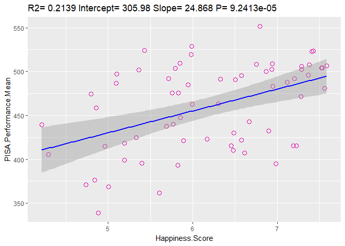

rmarkdown::render('../IT_Project/data/Regression_Analysis.Rmd', output_format = 'html_document')


## Setup

#### Correlation and Regression Analysis

Now we want to find out how our chosen datasets correlate with each other and, if yes, whether the correlations are of significance. Therefore we will firstly perform a correlation analysis between all relevant variables to get a grasp on their overall relationship. Following that we will pick out the strongest ones to examine in a linear regression analysis. 

### Load Libraries 

-- Load Library for reading CSV Files.
-- Load tidyr-library
-- Load dplyr-library


```r
library(csvread)
library(dplyr)
library(ggplot2)
library(corrplot)
library(knitr)
```
### Read data


### Correlation Analysis

-- Select relevant columns for correlation

Since we are looking only at numeric variables in the correlation analysis we will sort out the columns "Country" and "Region". In addition to that, the standard error of the Happiness Score will, too, be unnecessary to our following process.


```r
corr_data <- dplyr::select(data, Happiness.Score, Economy.GDP.per.Capita, Family, Health.Life.Expectancy,Freedom, Trust.Government.Corruption, Generosity, Dystopia.Residual,Alcohol.Consumption.All.Types,Beer, Wine, Spirits, Other, contains("PISA"))

corr_data<-corr_data%>%
  rename(Economy=Economy.GDP.per.Capita)%>%
  rename(Health=Health.Life.Expectancy)%>%
  rename(Corruption=Trust.Government.Corruption)%>%
  rename(Alc.All=Alcohol.Consumption.All.Types)%>%
  rename(Math=PISA.Performance.Mean.Mathematics)%>%
  rename(Reading=PISA.Performance.Mean.Reading)%>%
  rename(Science=PISA.Performance.Mean.Science)%>%
  rename(MeanPerf=PISA.Performance.Mean)
```

-- Perform Correlation


```r
#summary(cor(corr_data, use = "pairwise.complete.obs"))
corrplot(cor(corr_data, use = "pairwise.complete.obs"), method="number",tl.cex = 0.5, number.digits = 2, number.cex = 0.6, addrect = 5)
```

<!-- -->

--Interpretation


```r
pisa.alcohol.lm <- lm(PISA.Performance.Mean ~Beer + Wine+ Spirits+Other, data)
summary(pisa.alcohol.lm)
```

```
## 
## Call:
## lm(formula = PISA.Performance.Mean ~ Beer + Wine + Spirits + 
##     Other, data = data)
## 
## Residuals:
##      Min       1Q   Median       3Q      Max 
## -106.908  -25.682   -0.375   25.652  127.035 
## 
## Coefficients:
##             Estimate Std. Error t value Pr(>|t|)    
## (Intercept) 410.7483    11.7211  35.044  < 2e-16 ***
## Beer          8.7301     3.8290   2.280  0.02630 *  
## Wine          8.2333     3.1422   2.620  0.01120 *  
## Spirits       0.6274     4.0711   0.154  0.87806    
## Other        18.1966     6.1872   2.941  0.00469 ** 
## ---
## Signif. codes:  0 '***' 0.001 '**' 0.01 '*' 0.05 '.' 0.1 ' ' 1
## 
## Residual standard error: 42.57 on 58 degrees of freedom
##   (4 observations deleted due to missingness)
## Multiple R-squared:  0.3385,	Adjusted R-squared:  0.2929 
## F-statistic: 7.419 on 4 and 58 DF,  p-value: 6.758e-05
```

```r
pisa.alcohol2.lm <- lm(PISA.Performance.Mean ~Alcohol.Consumption.All.Types, data)
summary(pisa.alcohol2.lm)
```

```
## 
## Call:
## lm(formula = PISA.Performance.Mean ~ Alcohol.Consumption.All.Types, 
##     data = data)
## 
## Residuals:
##      Min       1Q   Median       3Q      Max 
## -113.363  -32.578    1.346   24.808  129.861 
## 
## Coefficients:
##                               Estimate Std. Error t value Pr(>|t|)    
## (Intercept)                    409.058     11.481  35.629  < 2e-16 ***
## Alcohol.Consumption.All.Types    7.057      1.396   5.054 3.76e-06 ***
## ---
## Signif. codes:  0 '***' 0.001 '**' 0.01 '*' 0.05 '.' 0.1 ' ' 1
## 
## Residual standard error: 42.2 on 65 degrees of freedom
## Multiple R-squared:  0.2821,	Adjusted R-squared:  0.2711 
## F-statistic: 25.54 on 1 and 65 DF,  p-value: 3.761e-06
```

```r
pisa.happiness.lm <- lm(PISA.Performance.Mean~Happiness.Score, data)
summary(pisa.happiness.lm)
```

```
## 
## Call:
## lm(formula = PISA.Performance.Mean ~ Happiness.Score, data = data)
## 
## Residuals:
##    Min     1Q Median     3Q    Max 
## -89.71 -37.29   6.47  29.89  82.15 
## 
## Coefficients:
##                 Estimate Std. Error t value Pr(>|t|)    
## (Intercept)      308.453     37.583   8.207 1.25e-11 ***
## Happiness.Score   24.624      6.007   4.099 0.000117 ***
## ---
## Signif. codes:  0 '***' 0.001 '**' 0.01 '*' 0.05 '.' 0.1 ' ' 1
## 
## Residual standard error: 44.4 on 65 degrees of freedom
## Multiple R-squared:  0.2054,	Adjusted R-squared:  0.1932 
## F-statistic:  16.8 on 1 and 65 DF,  p-value: 0.0001174
```

```r
happiness.alcohol.lm<-lm(Happiness.Score ~ Alcohol.Consumption.All.Types, data)
summary(happiness.alcohol.lm)
```

```
## 
## Call:
## lm(formula = Happiness.Score ~ Alcohol.Consumption.All.Types, 
##     data = data)
## 
## Residuals:
##      Min       1Q   Median       3Q      Max 
## -2.11333 -0.59461 -0.00626  0.80435  1.37965 
## 
## Coefficients:
##                               Estimate Std. Error t value Pr(>|t|)    
## (Intercept)                    5.93068    0.24678  24.033   <2e-16 ***
## Alcohol.Consumption.All.Types  0.03546    0.03001   1.181    0.242    
## ---
## Signif. codes:  0 '***' 0.001 '**' 0.01 '*' 0.05 '.' 0.1 ' ' 1
## 
## Residual standard error: 0.9071 on 65 degrees of freedom
## Multiple R-squared:  0.02102,	Adjusted R-squared:  0.005957 
## F-statistic: 1.396 on 1 and 65 DF,  p-value: 0.2418
```

```r
pisa.economy.lm <- lm(PISA.Performance.Mean ~ Economy.GDP.per.Capita , data)
summary(pisa.economy.lm)
```

```
## 
## Call:
## lm(formula = PISA.Performance.Mean ~ Economy.GDP.per.Capita, 
##     data = data)
## 
## Residuals:
##      Min       1Q   Median       3Q      Max 
## -131.874  -18.734   -0.432   23.354  116.358 
## 
## Coefficients:
##                        Estimate Std. Error t value Pr(>|t|)    
## (Intercept)              293.90      27.09  10.848 3.17e-16 ***
## Economy.GDP.per.Capita   145.10      23.17   6.264 3.39e-08 ***
## ---
## Signif. codes:  0 '***' 0.001 '**' 0.01 '*' 0.05 '.' 0.1 ' ' 1
## 
## Residual standard error: 39.34 on 65 degrees of freedom
## Multiple R-squared:  0.3764,	Adjusted R-squared:  0.3668 
## F-statistic: 39.23 on 1 and 65 DF,  p-value: 3.393e-08
```

Interpretation:

High levels of significance point to positive relationships between our chosen variables:

-- Different kinds of alcohol (Beer, Wine and Others especially) are significant predictor variables for the average PISA performance.
-- Alcohol consumption in general is a significant predictor variable for the average PISA performance.
-- The Happiness Score is a significant predictor for the average PISA performance.

However one has to consider the low levels of R-square in all of the aforementioned regressions. This means that, although the low P values indicate a real relationship between predictors and response variables, the precision of the prediction is not very high on all accounts.
This can be led to the fact, that our data is very processed, on the one hand Happiness Score being a highly calculated variable and on the other having average scores for entire countries, rather than single oberservation variables. 


Lack of significance for the relationship between Happiness Score and Alcohol Consumption. 


```r
plotRegression <- function(para){
  ggplot(para$model, aes_string(x=names(para$model)[2], y=names(para$model)[1]))+
    geom_point(shape=1, size=3, color="#DF01A5")+
    stat_smooth(method="lm", col="blue")+
    labs(title=paste("R2=", signif(summary(para)$r.squared,5),
                     "Intercept=", signif(para$coef[[1]],5),
                     "Slope=", signif(para$coef[[2]],5),
                     "P=",signif(summary(para)$coef[2,4],5)))
}

plot1<-plotRegression(lm(Happiness.Score~Alcohol.Consumption.All.Types, data))

plot3<-plotRegression(lm(PISA.Performance.Mean~Alcohol.Consumption.All.Types, data))
plot6<-plotRegression(lm(PISA.Performance.Mean~Happiness.Score, data))

plot1
```

<!-- -->

```r
plot3
```

<!-- -->

```r
plot6
```

<!-- -->

