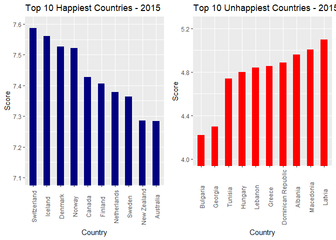
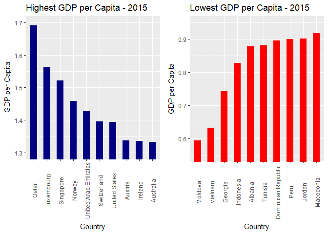
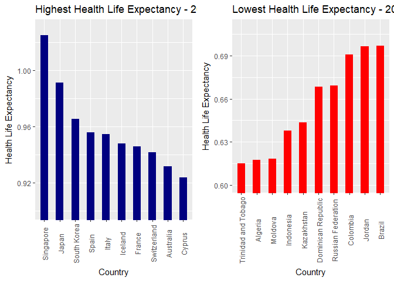
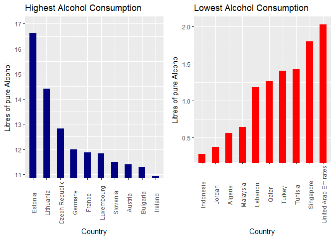
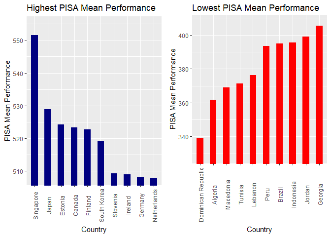
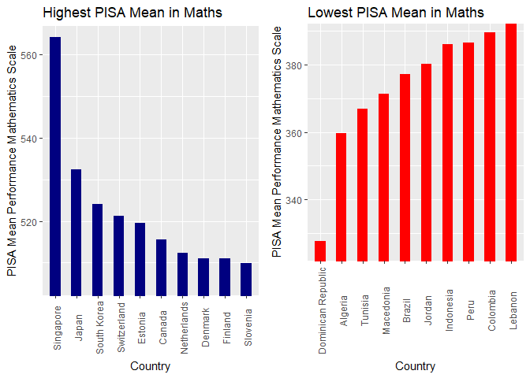
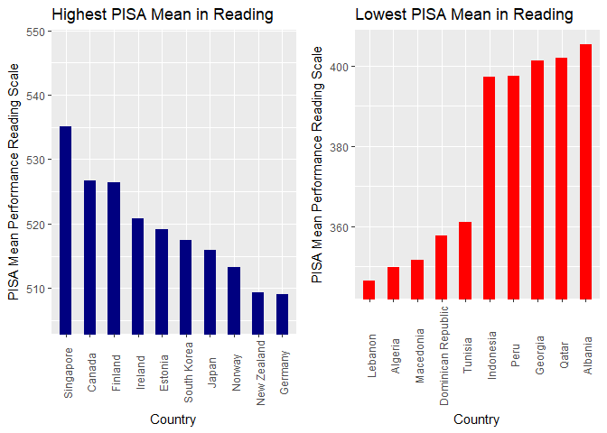
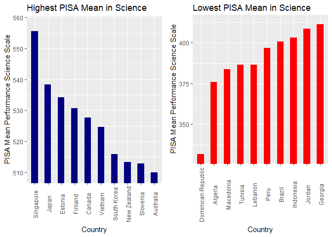

---


## Setup

### Load Librarys

-- Load required librarys


```r
require(csvread)
require(ggplot2)
require(gridExtra)
```


### Read cleaned CSV Files

-- Read CSV File "pisa_data.csv"  


```r
dfMasterData <- read.csv("../../data/master_data/master_data.min.csv")
```

## Top Ten Countries in different Studies 2015 {.tabset .tabset-fade}

-- This Top-Ten-Lists contain the countries which participated in all 3 studies (Happiness Record, PISA-Study, Alcohol Consumption Study)

### Happiness Score


```r
dfOrderedData <- head(dfMasterData[order(dfMasterData$Happiness.Score, decreasing = TRUE),], n = 10)

g1 <- ggplot2::ggplot(
  dfOrderedData, 
  ggplot2::aes(
    x=factor(Country,levels=dfOrderedData$Country[order(dfOrderedData$Happiness.Score, decreasing = TRUE)]),
  y=Happiness.Score))
g1 <- g1 + ggplot2::geom_bar(stat="identity",width=0.5,fill="navyblue")
g1 <- g1 + ggplot2::theme( axis.text.x = ggplot2::element_text(angle=90, vjust=0.6))
g1 <- g1 + ggplot2::labs(title="Top 10 Happiest Countries - 2015", x="Country",y="Score")
g1 <- g1 + ggplot2::coord_cartesian(ylim=c(7.1,7.6))


dfOrderedData2 <- tail(dfMasterData[order(dfMasterData$Happiness.Score, decreasing = TRUE),], n = 10)

g2 <- ggplot2::ggplot(
  dfOrderedData2, 
  ggplot2::aes(
    x=factor(Country,levels=dfOrderedData2$Country[order(dfOrderedData2$Happiness.Score, decreasing = FALSE)]),
  y=Happiness.Score))
g2 <- g2 + ggplot2::geom_bar(stat="identity",width=0.5,fill="red")
g2 <- g2 + ggplot2::theme( axis.text.x = ggplot2::element_text(angle=90, vjust=0.6))
g2 <- g2 + ggplot2::labs(title="Top 10 Unhappiest Countries - 2015", x="Country",y="Score")
g2 <- g2 + ggplot2::coord_cartesian(ylim=c(4,5.25))

gridExtra::grid.arrange(g1, g2,  ncol = 2,nrow=1)
```

<!-- -->


### GDP


```r
dfOrderedData <- head(dfMasterData[order(dfMasterData$Economy.GDP.per.Capita, decreasing = TRUE),], n = 10)

g1 <- ggplot2::ggplot(
        dfOrderedData, 
        ggplot2::aes(x=factor(dfOrderedData$Country,levels=dfOrderedData$Country[order(dfOrderedData$Economy.GDP.per.Capita, decreasing = TRUE)]),y=Economy.GDP.per.Capita)
      ) 
g1 <- g1 + ggplot2::geom_bar(stat="identity",width=0.5,fill="navyblue") 
g1 <- g1 + ggplot2::theme(axis.text.x = ggplot2::element_text(angle=90, vjust=0.6)) 
g1 <- g1 + ggplot2::labs(title="Highest GDP per Capita - 2015", x="Country",y="GDP per Capita") 
g1 <- g1 + ggplot2::coord_cartesian(ylim=c(1.3,1.7))

dfOrderedData2 <- tail(dfMasterData[order(dfMasterData$Economy.GDP.per.Capita, decreasing = TRUE),], n = 10)

g2 <- ggplot2::ggplot(
        dfOrderedData2, 
        ggplot2::aes(x=factor(dfOrderedData2$Country,levels=dfOrderedData2$Country[order(dfOrderedData2$Economy.GDP.per.Capita, decreasing = FALSE)]),y=Economy.GDP.per.Capita)
        ) 
g2 <- g2 + ggplot2::geom_bar(stat="identity",width=0.5,fill="red") 
g2 <- g2 + ggplot2::theme(axis.text.x = ggplot2::element_text(angle=90, vjust=0.6)) 
g2 <- g2 + ggplot2::labs(title="Lowest GDP per Capita - 2015", x="Country",y="GDP per Capita") 
g2 <- g2 + ggplot2::coord_cartesian(ylim=c(0.55,0.95))

gridExtra::grid.arrange(g1, g2,  ncol = 2,nrow=1)
```

<!-- -->


### Health Life Expectancy


```r
dfOrderedData <- head(dfMasterData[order(dfMasterData$Health.Life.Expectancy, decreasing = TRUE),], n = 10)

g1 <- ggplot2::ggplot(
        dfOrderedData, 
        ggplot2::aes(x=factor(dfOrderedData$Country,levels=dfOrderedData$Country[order(dfOrderedData$Health.Life.Expectancy, decreasing = TRUE)]),y=Health.Life.Expectancy)
      ) 
g1 <- g1 + ggplot2::geom_bar(stat="identity",width=0.5,fill="navyblue") 
g1 <- g1 + ggplot2::theme(axis.text.x = ggplot2::element_text(angle=90, vjust=0.6)) 
g1 <- g1 + ggplot2::labs(title="Highest Health Life Expectancy - 2015", x="Country",y="Health Life Expectancy") 
g1 <- g1 + ggplot2::coord_cartesian(ylim=c(0.9,1.03))

dfOrderedData2 <- tail(dfMasterData[order(dfMasterData$Health.Life.Expectancy, decreasing = TRUE),], n = 10)

g2 <- ggplot2::ggplot(
        dfOrderedData2, 
        ggplot2::aes(x=factor(dfOrderedData2$Country,levels=dfOrderedData2$Country[order(dfOrderedData2$Health.Life.Expectancy, decreasing = FALSE)]),y=Health.Life.Expectancy)
        ) 
g2 <- g2 + ggplot2::geom_bar(stat="identity",width=0.5,fill="red") 
g2 <- g2 + ggplot2::theme(axis.text.x = ggplot2::element_text(angle=90, vjust=0.6)) 
g2 <- g2 + ggplot2::labs(title="Lowest Health Life Expectancy - 2015", x="Country",y="Health Life Expectancy") 
g2 <- g2 + ggplot2::coord_cartesian(ylim=c(0.6,0.71))

gridExtra::grid.arrange(g1, g2,  ncol = 2,nrow=1)
```

<!-- -->


### Alcohol Consumption


```r
dfOrderedData <- head(dfMasterData[order(dfMasterData$Alcohol.Consumption.All.Types, decreasing = TRUE),], n = 10)

g1 <- ggplot2::ggplot(
        dfOrderedData, 
        ggplot2::aes(x=factor(dfOrderedData$Country,levels=dfOrderedData$Country[order(dfOrderedData$Alcohol.Consumption.All.Types, decreasing = TRUE)]),y=Alcohol.Consumption.All.Types)
      ) 
g1 <- g1 + ggplot2::geom_bar(stat="identity",width=0.5,fill="navyblue") 
g1 <- g1 + ggplot2::theme(axis.text.x = ggplot2::element_text(angle=90, vjust=0.6)) 
g1 <- g1 + ggplot2::labs(title="Highest Alcohol Consumption", x="Country",y="Litres of pure Alcohol") 
g1 <- g1 + ggplot2::coord_cartesian(ylim=c(11.15,17))

dfOrderedData2 <- tail(dfMasterData[order(dfMasterData$Alcohol.Consumption.All.Types, decreasing = TRUE),], n = 10)

g2 <- ggplot2::ggplot(
        dfOrderedData2, 
        ggplot2::aes(x=factor(dfOrderedData2$Country,levels=dfOrderedData2$Country[order(dfOrderedData2$Alcohol.Consumption.All.Types, decreasing = FALSE)]),y=Alcohol.Consumption.All.Types)
        ) 
g2 <- g2 + ggplot2::geom_bar(stat="identity",width=0.5,fill="red") 
g2 <- g2 + ggplot2::theme(axis.text.x = ggplot2::element_text(angle=90, vjust=0.6)) 
g2 <- g2 + ggplot2::labs(title="Lowest Alcohol Consumption", x="Country",y="Litres of pure Alcohol") 
g2 <- g2 + ggplot2::coord_cartesian(ylim=c(0.25,2.05))

gridExtra::grid.arrange(g1, g2,  ncol = 2,nrow=1)
```

<!-- -->


### PISA Mean Performance


```r
dfOrderedData <- head(dfMasterData[order(dfMasterData$PISA.Performance.Mean, decreasing = TRUE),], n = 10)

g1 <- ggplot2::ggplot(
        dfOrderedData, 
        ggplot2::aes(x=factor(dfOrderedData$Country,levels=dfOrderedData$Country[order(dfOrderedData$PISA.Performance.Mean, decreasing = TRUE)]),y=PISA.Performance.Mean)
      ) 
g1 <- g1 + ggplot2::geom_bar(stat="identity",width=0.5,fill="navyblue") 
g1 <- g1 + ggplot2::theme(axis.text.x = ggplot2::element_text(angle=90, vjust=0.6)) 
g1 <- g1 + ggplot2::labs(title="Highest PISA Mean Performance", x="Country",y="PISA Mean Performance") 
g1 <- g1 + ggplot2::coord_cartesian(ylim=c(508,555))

dfOrderedData2 <- tail(dfMasterData[order(dfMasterData$PISA.Performance.Mean, decreasing = TRUE),], n = 10)

g2 <- ggplot2::ggplot(
        dfOrderedData2, 
        ggplot2::aes(x=factor(dfOrderedData2$Country,levels=dfOrderedData2$Country[order(dfOrderedData2$PISA.Performance.Mean, decreasing = FALSE)]),y=PISA.Performance.Mean)
        ) 
g2 <- g2 + ggplot2::geom_bar(stat="identity",width=0.5,fill="red") 
g2 <- g2 + ggplot2::theme(axis.text.x = ggplot2::element_text(angle=90, vjust=0.6)) 
g2 <- g2 + ggplot2::labs(title="Lowest PISA Mean Performance", x="Country",y="PISA Mean Performance") 
g2 <- g2 + ggplot2::coord_cartesian(ylim=c(328,408))

gridExtra::grid.arrange(g1, g2,  ncol = 2,nrow=1)
```

<!-- -->


### PISA Mean Performance Mathematics


```r
dfOrderedData <- head(dfMasterData[order(dfMasterData$PISA.Performance.Mean.Mathematics, decreasing = TRUE),], n = 10)

g1 <- ggplot2::ggplot(
        dfOrderedData, 
        ggplot2::aes(x=factor(dfOrderedData$Country,levels=dfOrderedData$Country[order(dfOrderedData$PISA.Performance.Mean.Mathematics, decreasing = TRUE)]),y=PISA.Performance.Mean.Mathematics)
      ) 
g1 <- g1 + ggplot2::geom_bar(stat="identity",width=0.5,fill="navyblue") 
g1 <- g1 + ggplot2::theme(axis.text.x = ggplot2::element_text(angle=90, vjust=0.6)) 
g1 <- g1 + ggplot2::labs(title="Highest PISA Mean in Maths", x="Country",y="PISA Mean Performance Mathematics Scale") 
g1 <- g1 + ggplot2::coord_cartesian(ylim=c(505,564))

dfOrderedData2 <- tail(dfMasterData[order(dfMasterData$PISA.Performance.Mean.Mathematics, decreasing = TRUE),], n = 10)

g2 <- ggplot2::ggplot(
        dfOrderedData2, 
        ggplot2::aes(x=factor(dfOrderedData2$Country,levels=dfOrderedData2$Country[order(dfOrderedData2$PISA.Performance.Mean.Mathematics, decreasing = FALSE)]),y=PISA.Performance.Mean.Mathematics)
        ) 
g2 <- g2 + ggplot2::geom_bar(stat="identity",width=0.5,fill="red") 
g2 <- g2 + ggplot2::theme(axis.text.x = ggplot2::element_text(angle=90, vjust=0.6)) 
g2 <- g2 + ggplot2::labs(title="Lowest PISA Mean in Maths", x="Country",y="PISA Mean Performance Mathematics Scale") 
g2 <- g2 + ggplot2::coord_cartesian(ylim=c(325,389))

gridExtra::grid.arrange(g1, g2,  ncol = 2,nrow=1)
```

<!-- -->


### PISA Mean Performance Reading


```r
dfOrderedData <- head(dfMasterData[order(dfMasterData$PISA.Performance.Mean.Reading, decreasing = TRUE),], n = 10)

g1 <- ggplot2::ggplot(
        dfOrderedData, 
        ggplot2::aes(x=factor(dfOrderedData$Country,levels=dfOrderedData$Country[order(dfOrderedData$PISA.Performance.Mean.Reading, decreasing = TRUE)]),y=PISA.Performance.Mean.Reading)
      ) 
g1 <- g1 + ggplot2::geom_bar(stat="identity",width=0.5,fill="navyblue") 
g1 <- g1 + ggplot2::theme(axis.text.x = ggplot2::element_text(angle=90, vjust=0.6)) 
g1 <- g1 + ggplot2::labs(title="Highest PISA Mean in Reading", x="Country",y="PISA Mean Performance Reading Scale") 
g1 <- g1 + ggplot2::coord_cartesian(ylim=c(505,548))

dfOrderedData2 <- tail(dfMasterData[order(dfMasterData$PISA.Performance.Mean.Reading, decreasing = TRUE),], n = 10)

g2 <- ggplot2::ggplot(
        dfOrderedData2, 
        ggplot2::aes(x=factor(dfOrderedData2$Country,levels=dfOrderedData2$Country[order(dfOrderedData2$PISA.Performance.Mean.Reading, decreasing = FALSE)]),y=PISA.Performance.Mean.Reading)
        ) 
g2 <- g2 + ggplot2::geom_bar(stat="identity",width=0.5,fill="red") 
g2 <- g2 + ggplot2::theme(axis.text.x = ggplot2::element_text(angle=90, vjust=0.6)) 
g2 <- g2 + ggplot2::labs(title="Lowest PISA Mean in Reading", x="Country",y="PISA Mean Performance Reading Scale") 
g2 <- g2 + ggplot2::coord_cartesian(ylim=c(345,406))

gridExtra::grid.arrange(g1, g2,  ncol = 2,nrow=1)
```

<!-- -->


### PISA Mean Performance Science


```r
dfOrderedData <- head(dfMasterData[order(dfMasterData$PISA.Performance.Mean.Science, decreasing = TRUE),], n = 10)

g1 <- ggplot2::ggplot(
        dfOrderedData, 
        ggplot2::aes(x=factor(dfOrderedData$Country,levels=dfOrderedData$Country[order(dfOrderedData$PISA.Performance.Mean.Science, decreasing = TRUE)]),y=PISA.Performance.Mean.Science)
      ) 
g1 <- g1 + ggplot2::geom_bar(stat="identity",width=0.5,fill="navyblue") 
g1 <- g1 + ggplot2::theme(axis.text.x = ggplot2::element_text(angle=90, vjust=0.6)) 
g1 <- g1 + ggplot2::labs(title="Highest PISA Mean in Science", x="Country",y="PISA Mean Performance Science Scale") 
g1 <- g1 + ggplot2::coord_cartesian(ylim=c(509,558))

dfOrderedData2 <- tail(dfMasterData[order(dfMasterData$PISA.Performance.Mean.Science, decreasing = TRUE),], n = 10)

g2 <- ggplot2::ggplot(
        dfOrderedData2, 
        ggplot2::aes(x=factor(dfOrderedData2$Country,levels=dfOrderedData2$Country[order(dfOrderedData2$PISA.Performance.Mean.Science, decreasing = FALSE)]),y=PISA.Performance.Mean.Science)
        ) 
g2 <- g2 + ggplot2::geom_bar(stat="identity",width=0.5,fill="red") 
g2 <- g2 + ggplot2::theme(axis.text.x = ggplot2::element_text(angle=90, vjust=0.6)) 
g2 <- g2 + ggplot2::labs(title="Lowest PISA Mean in Science", x="Country",y="PISA Mean Performance Science Scale") 
g2 <- g2 + ggplot2::coord_cartesian(ylim=c(330,413))

gridExtra::grid.arrange(g1, g2,  ncol = 2,nrow=1)
```

<!-- -->


##
